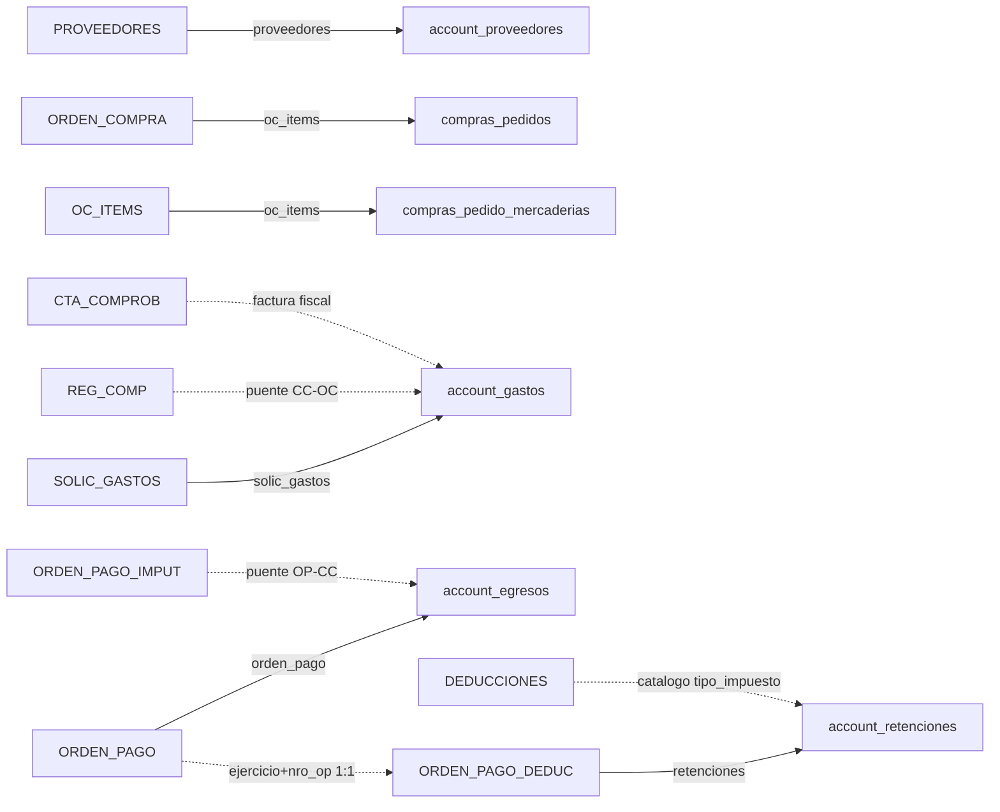

# RAFAM ↔ Paxapos — Equivalencias de Tablas (Fuente de verdad)

> **Este documento es la única fuente de verdad** sobre qué tablas de RAFAM se migran a Paxapos y cómo se mapean.
> Cualquier otra documentación que contradiga este archivo está desactualizada y debe corregirse.

El proyecto `rafam-ba-proveedores` migra datos desde Oracle RAFAM (schema `OWNER_RAFAM`) hacia el schema tenant de Paxapos (CakePHP 2) vía el endpoint `POST /{tenant}/rafam/migracion/importar.json`.

La migración se organiza en **5 entidades independientes**. Cada entidad es **1 comando = 1 checkpoint propio**: se ejecuta por separado y avanza su cursor de forma autónoma.

| Entidad (`--entity`) | Comando Makefile | Checkpoint | Tablas RAFAM | Destino Paxapos |
|---|---|---|---|---|
| `proveedores` | `make migrate-proveedores` | `proveedores` | `PROVEEDORES` | `account_proveedores` |
| `oc_items` | `make migrate-oc` | `oc_items` | `ORDEN_COMPRA` + `OC_ITEMS` | `compras_pedidos` + `compras_pedido_mercaderias` |
| `solic_gastos` | `make migrate-facturas` | `solic_gastos` | `SOLIC_GASTOS` + `CTA_COMPROB` | `account_gastos` |
| `orden_pago` | `make migrate-op` | `orden_pago` | `ORDEN_PAGO` | `account_egresos` |
| `retenciones` | `make migrate-retenciones` | `retenciones` | `ORDEN_PAGO_DEDUC` | `account_retenciones` |

> `make migrate-all` ejecuta las 5 en orden de dependencia (FK). Cada comando admite la variante `-dry` (`make migrate-oc-dry`, …) o el flag `--dry-run`: envía `"dry_run": true` y Paxapos **valida sin persistir** (modo preview profesional para revisar payload y conteos antes de escribir).

Una entidad puede combinar varias tablas RAFAM (p. ej. `oc_items` envía cabecera + ítems juntos; `orden_pago` resuelve y embebe gastos y retenciones). Además, hay **tablas de lookup / puente** que se leen para resolver datos (no se migran como entidad propia).

---

## 1. Resumen tabla por tabla

| # | RAFAM (Oracle) | Paxapos (MySQL tenant) | Entidad migrator |
|---|---|---|---|
| 1 | `PROVEEDORES` | `account_proveedores` | `proveedores` |
| 2 | `ORDEN_COMPRA` | `compras_pedidos` (con `tipo='orden_compra'`) | `oc_items` (cabecera + ítems en un payload) |
| 3 | `OC_ITEMS` | `compras_pedido_mercaderias` | `oc_items` |
| 4 | `SOLIC_GASTOS` + `CTA_COMPROB` | `account_gastos` | `solic_gastos` |
| 5 | `ORDEN_PAGO` | `account_egresos` | `orden_pago` |
| 6 | `ORDEN_PAGO_DEDUC` | `account_retenciones` | `retenciones` |

**Tablas RAFAM usadas como lookup / puente (NO se migran como entidad):**

| RAFAM | Uso |
|---|---|
| `ORDEN_PAGO_IMPUT` | **Puente primario** OP ↔ `CTA_COMPROB`. Modela la imputación física de cada OP a uno o más comprobantes (PK incluye `NRO_REG_COMP + TIPO_COMPROB + NRO_COMPROB + COD_PROV`). Reemplaza la lectura de la VIEW `CTA_HOJA_DE_RUTA`. Se usa al migrar `orden_pago` para armar el HABTM `account_egresos_gastos`. |
| `REG_COMP` | Puente `CTA_COMPROB` ↔ `ORDEN_COMPRA` (resuelve `account_gastos.pedido_id`). Comparte `EJERCICIO + NRO_OC + COD_PROV + JURISDICCION`. |
| `CTA_COMPROB` | Factura fiscal real del proveedor (número AFIP). No es entidad propia: `solic_gastos` la lee (vía `REG_COMP`) para crear `account_gastos`, y `orden_pago` la usa para enriquecer los gastos imputados. |
| `DEDUCCIONES` | Catálogo de tipos de retención. `ORDEN_PAGO_DEDUC.CODIGO_DEDUC` ↔ `DEDUCCIONES.CODIGO`. Se lee `DEDUCCIONES.DESCRIPCION` para resolver `account_retenciones.tipo_impuesto_id` por heurística. |
| `JURISDICCION` | Catálogo (`JURISDICCION`, `DENOMINACION`, `SELECCIONABLE`). Se lee la denominación para nombrar centros de costo si no están en `_JURISDICCION_CENTRO_COSTO_MAP`. |

> **Ya NO se usan:** la VIEW `CTA_HOJA_DE_RUTA` (reemplazada por las tablas reales `ORDEN_PAGO_IMPUT` + `REG_COMP`) ni la tabla `RETENCIONES` (reemplazada por `ORDEN_PAGO_DEDUC`, cuya clave `(EJERCICIO, NRO_OP)` es 1:1 con la OP; la clave `(EJERCICIO, NRO_CANCE)` de `RETENCIONES` es N:1 y asignaba las retenciones a la OP equivocada).

**Diagrama de vínculos (cadena canónica real):**

---

## 2. Detalle por par de tablas

### 2.1 `PROVEEDORES` → `account_proveedores`

| RAFAM | Paxapos | Notas |
|---|---|---|
| `COD_PROV` | `external_ref` (rafam, proveedores, cod_prov) | Identificador externo idempotente. |
| `RAZON_SOCIAL` | `razon_social` / `name` | |
| `CUIT` | `documento_fiscal` | |
| `COD_IVA` | `iva_responsabilidad_id` | Vía `_IVA_MAP` en `gateway_mapper.py` (RINS=1, EXEN=2, NGAN=3, CF=4, RNI=5, MONOT=6, etc.). |
| `CALLE_LEGAL` + `NRO_LEGAL` | `direccion` | Concatenados en `_join_address()`. |
| `LOC`, etc. | `localidad`, ... | |
| `EMAIL` | `mail` | Truncado a 100 caracteres. |
| `ING_BRUTOS` | (no mapeado) | **TODO**: pendiente mapear a `numero_ingresos_brutos` en `account_proveedores` cuando el schema lo soporte. |
| `FECHA_ULT_COMP` | (filtro incremental) | Usado como `ts_field` en `config.py` para cargas incrementales — sólo se reimportan proveedores con compras desde la última corrida. |

### 2.2 `ORDEN_COMPRA` → `compras_pedidos` (tipo='orden_compra')

| RAFAM | Paxapos | Notas |
|---|---|---|
| `EJERCICIO` + `UNI_COMPRA` + `NRO_OC` | `external_ref` | Identificador externo idempotente. |
| `COD_PROV` | `proveedor_id` | Resuelto por `external_ref`. |
| `JURISDICCION` | `centro_costo_id` | Vía `resolve_centro_costo_id()`. |
| `FECH_EMI` | `fecha` | |
| `IMPORTE_TOT` | `total` | |
| (siempre) | `tipo` | Hardcoded `'orden_compra'`. |

### 2.3 `OC_ITEMS` → `compras_pedido_mercaderias`

Ítems de la OC. Se enviarán dentro del payload `ordenes_compra[].items[]`.

| RAFAM | Paxapos | Notas |
|---|---|---|
| `EJERCICIO` + `UNI_COMPRA` + `NRO_OC` + `ITEM_OC` | `external_ref` | |
| `EJERCICIO` + `UNI_COMPRA` + `NRO_OC` | (FK) → OC | Vincula al pedido padre. |
| `DESCRIPCION` | `mercaderia.name` | Si no existe, se crea. |
| `UNI_MED` | `mercaderia.unidad_de_medida_id` | Vía `_UM` (UNIDAD=1, KILOGRAMO=2, LITRO=3, METRO=4, PAQUETE=5, HORAS=6, DIA=7). Default `1` (Unidad). |
| `CANT` | `cantidad` | |
| `PRECIO_UNIT` | `precio_unitario` | |
| `CLASE` + `TIPO` + `INCISO` + `PAR_PRIN` + `PAR_PARC` | `mercaderia.codigo_clasificacion` | Si dos ítems comparten la misma clasificación, comparten la misma `mercaderia` en Paxapos. |

### 2.4 `SOLIC_GASTOS` + `CTA_COMPROB` → `account_gastos` (entidad `solic_gastos`)

Facturas reales del proveedor (con número fiscal AFIP). **Pasada standalone `solic_gastos`** (`make migrate-facturas`): recorre `SOLIC_GASTOS` y, vía `REG_COMP`, trae el comprobante fiscal de `CTA_COMPROB` para crear/actualizar el `Gasto`, resolviendo `pedido_id` contra las OCs ya migradas.

> **Reglas de omisión:** una SG se omite si `CTA_COMPROB_COUNT != 1` (no resuelve a un único comprobante fiscal) o si el comprobante no tiene `NRO_COMPROB`. Así se evitan gastos ambiguos o sin número fiscal.

| RAFAM | Paxapos | Notas |
|---|---|---|
| `EJERCICIO` + `NRO_REG_COMP` (vía REG_COMP) | `external_ref` | |
| `COD_PROV` | `proveedor_id` | |
| `TIPO` (FAA/FAB/FAC/...) | `tipo_factura_id` | Vía `RAFAM_TIPO_COMPROB_TO_PAXAPOS_NAME` → lookup por `name` en `afip_tipo_facturas`. |
| `NRO_COMPROB` | `factura_nro` | Número fiscal de la factura. |
| `FECH_COMPROB` | `fecha` | |
| `IMPORTE_COMPR` | `importe_total` | Total crudo del comprobante RAFAM. |
| `IMPORTE_LIQUIDO` / `IMPORTE_NETO` / `IMPORTE_SIN_IVA` | `importe_neto` | Neto/líquido crudo del comprobante. El script prefiere `IMPORTE_LIQUIDO`, luego `IMPORTE_NETO`, luego `IMPORTE_SIN_IVA`; no calcula netos en Python. |
| `JURISDICCION` | `centro_costo_id` | |
| (vía REG_COMP → ORDEN_COMPRA) | `pedido_id` | FK a `compras_pedidos.id` cuando la factura tiene OC asociada. |

### 2.5 `ORDEN_PAGO` → `account_egresos`

> **Filtro de migración:** se migran OPs con `ESTADO_OP IN ('C', 'N')`, `CONFIRMADO = 'S'`, `FECH_CONFIRM` presente, importe positivo y OC/gasto resoluble por la cadena canónica `ORDEN_PAGO_IMPUT -> REG_COMP -> ORDEN_COMPRA`. Las OPs anuladas (`A`), no confirmadas, sin fecha, sin importe válido o sin OC linkeada se omiten.

| RAFAM | Paxapos | Notas |
|---|---|---|
| `EJERCICIO` + `NRO_OP` | `external_ref` | |
| `COD_PROV` | `proveedor_id` | |
| `FECH_CONFIRM` | `fecha` | Sólo cuando `ESTADO_OP IN ('C', 'N')`, `CONFIRMADO='S'` y la OP tiene OC/gasto canónico. |
| `IMPORTE_TOTAL` | `importe_total` | Total bruto de la OP. El payload conserva también `Egreso.total` por compatibilidad con el importador actual. |
| `IMPORTE_LIQUIDO` | `importe_neto` | Neto líquido informativo según RAFAM. **`neto_transferido` NO se envía:** Paxapos lo calcula como `total − retenciones` en `_replaceRetencionesForEgreso`. |
| `TIPO_CANCE` (CA/CM/NO) | `tipo_de_pago_id` | Vía `RAFAM_TIPO_CANCE_TO_PAXAPOS_PAGO_NAME` → lookup por `name` en `tipo_de_pagos`. Default `"Transferencia bancaria"`. |
| `JURISDICCION` | `centro_costo_id` | |
| (vía `ORDEN_PAGO_DEDUC`) | `retenciones[]` (embebidas) | `orden_pago` embebe las retenciones de la OP (deducciones 1:1 por `EJERCICIO + NRO_OP`) dentro del payload del egreso. Si la suma supera el `total` de la OP se descartan y se loguea. Ver §2.6. |
| (vía `ORDEN_PAGO_IMPUT` → `REG_COMP`) | HABTM `account_egresos_gastos` | Vincula el egreso con uno o varios gastos (`CTA_COMPROB`) por la imputación física de la OP. Las OPs sin `ORDEN_PAGO_IMPUT` se omiten. |

### 2.6 `ORDEN_PAGO_DEDUC` → `account_retenciones` (entidad `retenciones`)

Las retenciones se traen de `ORDEN_PAGO_DEDUC` (clave **1:1** `EJERCICIO + NRO_OP`), **no** de la tabla `RETENCIONES` (cuya clave `EJERCICIO + NRO_CANCE` es N:1 con la OP y asignaba mal). `ORDEN_PAGO_DEDUC` corresponde a las Órdenes de Pago normales (`ORDEN_PAGO`); no confundir con `ORDEN_PAGOEA_DEDUC` (Egresos Adicionales, no migrados).

Hay **dos caminos idempotentes** que emiten la misma sección `retenciones`:
- **`orden_pago`** las embebe inline en el payload del egreso (mismo `external_id`).
- **`retenciones`** (pasada standalone, `make migrate-retenciones`) recorre `ORDEN_PAGO`, trae las deducciones y emite `retenciones[]` top-level **solo para OPs ya migradas** (con link). Las OPs sin Egreso aún en Paxapos se encolan como `dependency_missing` para reintentar.

| RAFAM (`ORDEN_PAGO_DEDUC`) | Paxapos | Notas |
|---|---|---|
| `EJERCICIO` + `NRO_OP` + `CODIGO_DEDUC` | `external_id` | Identificador idempotente de la retención. |
| (link `orden_pago` por `EJERCICIO + NRO_OP`) | `egreso_id` | FK a `account_egresos.id`. Se resuelve por el link store; si la OP no está migrada, se encola. |
| `CODIGO_DEDUC` + `DEDUCCIONES.DESCRIPCION` | `tipo_impuesto_id` | Heurística por substring/alias: `"IVA"`→102, `"GANANCIA"`→103, `"INGRESOS BRUTOS"`/`"IIBB"`→104, `"SUSS"`→105, `"MEDICOS"`/`"CAJA MED"`→110. Si no matchea catálogo, se omite y se loguea. |
| `IMPORTE_RETEN` | `monto_retenido` | Se descarta si es 0 o no numérico. |
| `ALICUOTA` | `alicuota` | Solo si está disponible y > 0. |
| `COMPROB_DEDUC` | `numero_certificado` | Si falta, default `RAFAM-RET-{ejercicio}-{nro_op}-{codigo_deduc}`. |
| `DEDUCCIONES.DESCRIPCION` | `observacion` | `"Deduccion RAFAM {descripcion} OP {ej}/{nro_op}"` cuando hay descripción. |

---

## 3. Alertas y validaciones

- **Idempotencia obligatoria:** todo registro migrado debe llevar `external_ref = {source: "rafam", entity: <tabla>, ...claves naturales}` para que reimportar no genere duplicados.
- **`compras_pedidos.tipo` siempre `'orden_compra'`** en esta migración. No se sincronizan otros tipos.
- **Filtro de OPs:** se migran las que tienen `ESTADO_OP IN ('C')` + `CONFIRMADO='S'` + `FECH_CONFIRM` + importe positivo + OC/gasto canónico. Las anuladas (`A`), normales (N), no confirmadas o sin OC linkeada se omiten. Esto se verifica en `exporter.py` y `source_repository.py`.
- **`pedido_id` en `account_gastos`** debe resolverse desde la cadena `CTA_COMPROB → REG_COMP → ORDEN_COMPRA`. Si no hay OC migrada/linkeada, la OP y su `gastos[]` se omiten para evitar pagos o gastos sueltos.
- **`RAFAM_EJERCICIO_MIN`:** el filtro de ejercicio aplica a `oc_items`, `orden_pago` y `retenciones`. La excepción para incluir OCs anteriores se limita a OPs confirmadas dentro del alcance actual (`EJERCICIO >= mínimo` o `FECH_CONFIRM` desde el 1/1 del mínimo); OPs históricas no deben arrastrar OCs viejas.
- **`unidad_de_medida_id` default = 1 (Unidad)**. Antes había un bug que ponía 5 (Paquete); está corregido en `gateway_mapper.py`.
- **`PROVEEDORES.ING_BRUTOS` no se migra hoy** — pendiente. Si el negocio lo necesita, agregar mapeo en `gateway_mapper.py::map_proveedor()`.

---

## 4. Orden lógico y comandos

Las 5 entidades son **independientes** (1 comando = 1 checkpoint), pero deben ejecutarse en **orden de dependencia (FK)** porque cada una resuelve enlaces creados por la anterior vía el link store local:

1. `proveedores` (`make migrate-proveedores`): crea/actualiza `account_proveedores` desde `PROVEEDORES`.
2. `oc_items` (`make migrate-oc`): agrupa `ORDEN_COMPRA` + `OC_ITEMS` y envía `ordenes_compra[]` con `items[]` inline (cabecera + mercaderías en una sola pasada).
3. `solic_gastos` (`make migrate-facturas`): crea `account_gastos` desde `SOLIC_GASTOS` + `CTA_COMPROB` (vía `REG_COMP`), resolviendo `pedido_id` contra las OCs ya migradas.
4. `orden_pago` (`make migrate-op`): crea `account_egresos` desde `ORDEN_PAGO`, vincula gastos (HABTM `account_egresos_gastos` vía `ORDEN_PAGO_IMPUT`) y embebe retenciones (`ORDEN_PAGO_DEDUC`).
5. `retenciones` (`make migrate-retenciones`): reenvía idempotentemente `account_retenciones` desde `ORDEN_PAGO_DEDUC` para las OPs ya migradas.

`make migrate-all` encadena las 5 en este orden. Cada comando tiene su variante `-dry` (o `--dry-run`) que envía `"dry_run": true` para que Paxapos **valide sin persistir** — método de preview profesional para revisar el payload y los conteos antes de escribir. Los checkpoints se reinician con `make reset-<entidad>` (o `make reset-all`).

---

## 5. Catálogo de IDs de Paxapos (extraídos de `packages/cakephp/Config/Schema/risto.php`)

### 5.1 `tipo_documentos`

| id | codigo_fiscal | name | codigo_afip |
|---|---|---|---|
| 1 | C | CUIT | 80 |
| 2 | L | CUIL | 86 |
| 3 | 0 | Libreta de Enrolamiento | 89 |
| 4 | 1 | Libreta Cívica | 90 |
| 5 | 2 | DNI | 96 |
| 6 | 3 | Pasaporte | 94 |
| 7 | 4 | Cédula de Identidad | 0 |
| 8 | (vacío) | Sin identificar | 99 |

### 5.2 `afip_iva_responsabilidades`

| id | codigo_fiscal | name |
|---|---|---|
| 1 | I | Resp. Inscripto |
| 2 | E | Exento |
| 3 | A | No Responsable |
| 4 | C | Consumidor Final |
| 5 | T | No Categorizado |
| 6 | M | Responsable Monotributo |

### 5.3 `account_tipo_impuestos` (sólo retenciones — entidad `retenciones`, fuente `ORDEN_PAGO_DEDUC`)

| id | name | subsistema | tributo_afip_codigo |
|---|---|---|---|
| 102 | Retención de IVA | tributo | 1 (Nacional) |
| 103 | Retención de Ganancias | tributo | 1 (Nacional) |
| 104 | Retención de IIBB | tributo | 2 (Provincial) |
| 105 | Retención SUSS | tributo | 1 (Nacional) |
| 110 | Retención Caja de Médicos | tributo | 99 (Otros) |

> Otros IDs (1=IVA 21%, 2=IVA 10.5%, etc.) no se usan en esta migración.

### 5.4 `afip_tipo_facturas`

Lookup dinámico por `name` (no se hardcodean IDs). El mapping `RAFAM_TIPO_COMPROB_TO_PAXAPOS_NAME` resuelve el `name` y luego CakePHP busca por nombre.

### 5.5 `tipo_de_pagos`

Lookup dinámico por `name`. El mapping `RAFAM_TIPO_CANCE_TO_PAXAPOS_PAGO_NAME` resuelve el `name`.

### 5.6 `centros_costo` (por tenant)

Hardcoded en `_JURISDICCION_CENTRO_COSTO_MAP` (`gateway_mapper.py`):

| CentroCosto.id | Nombre | JURISDICCION RAFAM |
|---|---|---|
| 1 | Salud | 1110104000 |
| 2 | Obras Públicas | 1110103000 |
| 3 | Desarrollo | 1110106000 |
| 4 | Corralón / Mantenimiento | 1110118000 |
| 5 | Seguridad | 1110113000 |
| 6 | CASER | 1110111000 |
| 7 | Administrativo - General | 1110101000, 1110102000, 1110200000, 1110112000, 1110115000, 1110117000, 1110105000, 1110108000, 1110109000 |
| 8 | Otro | (default) |

### 5.7 `compras_unidad_de_medidas`

| id | name |
|---|---|
| 1 | Unidad (default) |
| 2 | Kilogramo |
| 3 | Litro |
| 4 | Metro |
| 5 | Paquete |
| 6 | Horas |
| 7 | Día |

---

## 6. Tablas RAFAM que NO se usan

Cualquier referencia en docs viejas a las siguientes tablas/estructuras es **obsoleta** y debe ignorarse:

- **`RETENCIONES`** — reemplazada por `ORDEN_PAGO_DEDUC` (clave 1:1 por `NRO_OP`). La clave `(EJERCICIO, NRO_CANCE)` de `RETENCIONES` es N:1 con la OP y asignaba retenciones a la orden equivocada.
- **VIEW `CTA_HOJA_DE_RUTA`** — reemplazada por las tablas reales `ORDEN_PAGO_IMPUT` + `REG_COMP`.
- **`ORDEN_PAGOEA` / `ORDEN_PAGOEA_DEDUC`** — Órdenes de Pago de Egresos Adicionales; fuera del alcance de este pipeline.

> El proyecto cubre exclusivamente las tablas listadas en §1, organizadas en las **5 entidades** (`proveedores`, `oc_items`, `solic_gastos`, `orden_pago`, `retenciones`), más los lookups documentados.

---

**Última actualización:** mayo 2026.
