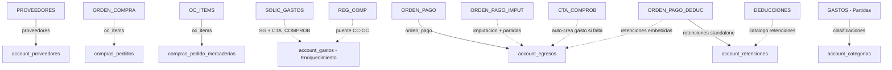

# RAFAM ↔ Paxapos — Equivalencias de Tablas y Flujos (Fuente de verdad)

> **Este documento es la única fuente de verdad** sobre qué tablas de RAFAM se migran a Paxapos, sus flujos de sincronización, resiliencia y cómo se mapean contra el schema tenant de Paxapos (CakePHP 2).
> Cualquier otra documentación que contradiga este archivo está desactualizada y debe corregirse.

El proyecto `rafam-ba-proveedores` migra datos desde Oracle RAFAM (schema `OWNER_RAFAM`) hacia el schema tenant de Paxapos (CakePHP 2) vía el endpoint `POST /{tenant}/rafam/migracion/importar.json` (`RafamMigracionesController`).

---

## 1. Resumen de Entidades Migradas

La migración se organiza en **6 entidades independientes** (5 del pipeline transaccional en orden de FKs + 1 catálogo del clasificador presupuestario). Cada entidad posee su propio comando, checkpoint y cursor autónomo.

| Entidad (`--entity`) | Comando Makefile | Checkpoint | Tablas Origen RAFAM | Destino Paxapos (MySQL tenant) | Acción / Modo |
|---|---|---|---|---|---|
| `proveedores` | `make migrate-proveedores` | `proveedores` | `PROVEEDORES` | `account_proveedores` | Upsert / Sync por Hash |
| `oc_items` | `make migrate-oc` | `oc_items` | `ORDEN_COMPRA` + `OC_ITEMS` | `compras_pedidos` + `compras_pedido_mercaderias` | Creación + Anulación |
| `solic_gastos` | `make migrate-facturas` | `solic_gastos` | `SOLIC_GASTOS` + `CTA_COMPROB` | `account_gastos` | Enriquecimiento (UPDATE-ONLY) |
| `orden_pago` | `make migrate-op` | `orden_pago` | `ORDEN_PAGO` + `ORDEN_PAGO_IMPUT` + `CTA_COMPROB` + `ORDEN_PAGO_DEDUC` | `account_egresos` (auto-crea `account_gastos` + retenciones) | Creación / Modificación |
| `retenciones` | `make migrate-retenciones` | `retenciones` | `ORDEN_PAGO_DEDUC` (+ `ORDEN_PAGO`) | `account_retenciones` | Standalone por OP (F3/F4) |
| `clasificaciones` | `python main.py run --entity clasificaciones` | `clasificaciones` | `GASTOS` (distinct `INCISO..DENOMINACION`) | `account_categorias` | Catálogo arbolado (4 niveles) |

> `make migrate-all` ejecuta las 5 entidades transaccionales en estricto orden de dependencia (FK). Cada comando admite la variante `-dry` (`make migrate-oc-dry`, …) o el flag `--dry-run`: envía `"dry_run": true` y Paxapos **valida sin persistir** (modo preview para revisar payload y conteos antes de escribir).

### Tablas RAFAM de Lookup / Puente (NO se migran como entidad propia)

| Tabla RAFAM | Uso en el Script |
|---|---|
| `ORDEN_PAGO_IMPUT` | **Puente primario** OP ↔ `CTA_COMPROB`. Modela la imputación física de cada OP a sus comprobantes (PK `NRO_REG_COMP + TIPO_COMPROB + NRO_COMPROB + COD_PROV`). También provee las columnas de partida presupuestaria (`OPI_INCISO`, `OPI_PAR_PRIN`, `OPI_PAR_PARC`, `OPI_PAR_SUBP`). |
| `REG_COMP` | Puente `CTA_COMPROB` ↔ `ORDEN_COMPRA` (resuelve `account_gastos.pedido_id`). Comparte `EJERCICIO + NRO_OC + COD_PROV + JURISDICCION`. |
| `CTA_COMPROB` | Comprobante fiscal del proveedor (número AFIP). `solic_gastos` la lee para enriquecer gastos, y `orden_pago` la utiliza para auto-crear gastos sueltos o desambiguar imputaciones. |
| `DEDUCCIONES` | Catálogo de tipos de retención. `ORDEN_PAGO_DEDUC.CODIGO_DEDUC` ↔ `DEDUCCIONES.CODIGO`. Se lee `DEDUCCIONES.DESCRIPCION` para resolver `tipo_impuesto_id` por heurística/alias. |
| `JURISDICCION` | Catálogo de jurisdicciones. Se utiliza `resolve_centro_costo_id()` para mapear a `centros_costo` en Paxapos. |
| `COMPROBANTES` (vía `EGRESOS`) | Provee la forma de pago real (`ORIGEN_TIPO`: `CA`/`CM`=Cheque, `NO`=Transferencia) para cada OP. |

> **Estructuras obsoletas / NO utilizadas:**
> - `RETENCIONES` (reemplazada por `ORDEN_PAGO_DEDUC`: su clave `(EJERCICIO, NRO_CANCE)` era N:1 y asignaba retenciones a la OP equivocada).
> - VIEW `CTA_HOJA_DE_RUTA` (reemplazada por las tablas relacionales reales `ORDEN_PAGO_IMPUT` + `REG_COMP`).
> - `ORDEN_PAGOEA` / `ORDEN_PAGOEA_DEDUC` (Egresos Adicionales, fuera del alcance).

### Diagrama de Vínculos y Flujo Canónico

---

## 2. Detalle de Mapeos por Entidad

### 2.1 `PROVEEDORES` → `account_proveedores`

- **Filtro / Blocklist (`EXCLUDED_COD_PROV`):** Proveedores de servicios públicos, cajas chicas, viáticos, bancos u organismos (Telefónica, Camuzzi, Edea, Banco Provincia, etc.) definidos en `config.py` y ampliables vía env `RAFAM_EXCLUDED_COD_PROV` se **excluyen totalmente** del pipeline.

| Campo RAFAM | Campo Paxapos | Notas y Reglas |
|---|---|---|
| `COD_PROV` | `external_id.cod_prov` | Identificador externo idempotente. |
| `FANTASIA` / `RAZON_SOCIAL` | `Proveedor.name` | Preferencia por `FANTASIA`; si falta, `RAZON_SOCIAL`. Truncado a 100 chars. |
| `RAZON_SOCIAL` | `Proveedor.razon_social` | Truncado a 200 chars. |
| `CUIT` | `Proveedor.cuit` | Normalizado a 11 dígitos numéricos limpios. |
| `CUIT` (si presente) | `Proveedor.tipo_documento_id` | Hardcoded `1` (CUIT, AFIP 80). |
| `COD_IVA` | `Proveedor.iva_condicion_id` | Mapeo vía `_IVA_MAP`: `RINS`→1, `EXEN`→2, `NGAN`→3, `CF`→4, `RNI`/`RNIS`→5, `MONOT`/`M.SOC`/`MSOC`→6. |
| `CALLE_LEGAL` + `NRO_LEGAL` | `Proveedor.domicilio` | Concatenados con espacio. Fallback a `CALLE_POSTAL` + `NRO_POSTAL`. Truncado a 100. |
| `LOCA_LEGAL` / `PROV_LEGAL` / `COD_LEGAL` | `localidad` / `provincia` / `codigo_postal` | Con fallback a campos POSTAL. Truncados a 100 (CP a 10). |
| `NRO_PAIS_TE1`..`TE_CELULAR` | `Proveedor.telefono` | Concatenación inteligente de prefijos y números. Truncado a 100. |
| `EMAIL` | `Proveedor.mail` | Truncado a 100 chars. |
| `FECHA_ULT_COMP` | Cursor Incremental (`ts_field`) | Marca de agua para cargas incrementales. |

- **Detección de Cambios (Update por Hash):** Calcula hash SHA-256 (`_HASH_FIELDS`) de los datos de negocio. En ejecuciones `sync-changes`, si el hash cambió en RAFAM, inyecta `Proveedor.id` local y actualiza Paxapos.

---

### 2.2 `ORDEN_COMPRA` + `OC_ITEMS` → `compras_pedidos` + `compras_pedido_mercaderias`

- **Agrupamiento:** Agrupa `OC_ITEMS` por cabecera `(EJERCICIO, UNI_COMPRA, NRO_OC)`. Se omiten OCs de proveedores en la blocklist o sin link remoto de proveedor en Paxapos.

#### Cabecera (`ORDEN_COMPRA`)

| Campo RAFAM | Campo Paxapos | Notas y Reglas |
|---|---|---|
| `EJERCICIO + UNI_COMPRA + NRO_OC` | `external_id` | Identificador externo compuesto. |
| `EJERCICIO` + `NRO_OC` | `Pedido.internal_id` | Formato `{ejercicio % 100}-{nro_oc}` (ej: `26-104`). |
| (fijo) | `Pedido.tipo` | Hardcoded `'orden_compra'`. |
| (fijo) | `Pedido.estado_aprobacion` | Hardcoded `2` (Aprobado). |
| `COD_PROV` | `Pedido.proveedor_id` | Resuelto desde `link_store` (`proveedores`). |
| `SG_JURISDICCION` | `centro_costo_id` | Resuelto vía `resolve_centro_costo_id()`. |
| `OC_FECH_OC` | `Pedido.created` | Formato `YYYY-MM-DD 00:00:00`. |
| `OC_OBSERVACIONES` | `Pedido.observacion` | Truncado a 255. |

#### Ítems (`OC_ITEMS`)

| Campo RAFAM | Campo Paxapos | Notas y Reglas |
|---|---|---|
| `DESCRIPCION` | `item.name` | Descripción limpia de la mercadería. |
| `CANTIDAD` | `item.cantidad` | Float. |
| `IMP_UNITARIO` | `item.precio_unitario` | Float redondeado a 2 decimales. **Base imponible: ver nota abajo (issue #414).** |
| `CANT_RECIB` | `item.recibida_cantidad` | Float. |
| `UNI_MED` | `item.unidad_de_medida_id` | Mapeo `_UM_DEFAULT = 5` (Unidad). |
| `SG_JURISDICCION` | `item.centro_costo_id` | Centro de costo del ítem. |
| — (`RAFAM_COD_PROV_PRECIO_CON_IVA`) | `item.precio_incluye_iva` | Bool, solo si `COD_PROV` está en la env var (confirmación manual). |
| — (`RAFAM_ALICUOTA_IVA_DEFAULT`) | `item.alicuota_iva` | %, solo junto con `precio_incluye_iva=true`. |

> **Base imponible de `IMP_UNITARIO` (issue #414):** `OC_ITEMS`/`ORDEN_COMPRA` en RAFAM **no tienen ninguna columna de IVA/alícuota** — el contrato de origen no dice si `IMP_UNITARIO` viene neto o bruto. `Compras.DiagnosticoImportesOc` (lado Paxapos) detectó que una porción relevante de las OC de `madariaga` tiene el IVA metido adentro de `compras_pedido_mercaderias.precio` (columna que el modelo Paxapos define como SIN impuestos). Como no hay señal confiable en el dato crudo, este mapper **nunca adivina**: por default `IMP_UNITARIO` se pasa tal cual y Paxapos lo asume neto (mismo comportamiento de siempre). Si en el futuro un humano confirma, revisando facturas reales, que un proveedor puntual manda `IMP_UNITARIO` bruto, se lo agrega a `RAFAM_COD_PROV_PRECIO_CON_IVA` (+ `RAFAM_ALICUOTA_IVA_DEFAULT`) y el exportador declara `precio_incluye_iva`/`alicuota_iva` en el payload; `RafamMigracionesController::_normalizeItemsPrecio` (cakephp) recién ahí convierte a neto antes de guardar. Ver `src/config.py` (`is_cod_prov_precio_con_iva`) y `.env.example`.

> **Lógica de Mercadería (sin sufijos `[RAFAM-...]`):** El script no envía `mercaderia_external_ref` en el payload de OC para evitar que Paxapos genere nombres visibles con sufijos feos. La mercadería se resuelve vía `resolver_mercaderia.json` por nombre limpio y se persiste el link local `name:{normalizada}` → `mercaderia_id` en SQLite. Paxapos le asigna un `barcode` determinista (`RAFAM-NAME:{hash}`).

#### Reglas de Estado de OC
- **`OC_ESTADO_OC = 'R'` (Registrada/Emitida):** Se crea o reenvía (si el hash del payload cambió).
- **`OC_ESTADO_OC = 'A'` (Anulada):** 
  - Si no tiene OP asociada en Paxapos → Se envía con `Pedido.deleted = 1` para anular en Paxapos.
  - **Protección de Integridad:** Si la OC ya tiene OP asociada (`has_op = 1` en `link_store`), **NO se elimina** en Paxapos para no romper la trazabilidad del pago.
- **OCs con Comprobante (`OC_CC_NRO`) o Pago (`has_op`):** Se envían a Paxapos como fallback aunque su estado sea distinto de `'R'`.

---

### 2.3 `SOLIC_GASTOS` + `CTA_COMPROB` → `account_gastos` (Entidad `solic_gastos`)

- **Modo Enriquecimiento (UPDATE-ONLY):** No crea gastos sueltos. Su objetivo es completar campos vacíos de gastos que Paxapos ya creó automáticamente cuando el proveedor subió la factura vinculada a una OC (`account_gastos.pedido_id`).
- **Filtro de Omisión:** Se saltea la SG si `ESTADO_SOLIC = 'A'`, si `CTA_COMPROB_COUNT != 1` (ambigüedad fiscal), o si `CTA_COMPROB.NRO_COMPROB` viene vacío.

| Campo RAFAM | Campo Paxapos | Notas |
|---|---|---|
| `EJERCICIO + DELEG_SOLIC + NRO_SOLIC` | `external_id` | Ref externa `SG-{ejercicio}-{deleg}-{nro}`. |
| `FECH_SOLIC` | `Gasto.fecha` | Formato `YYYY-MM-DD`. |
| `CTA_IMPORTE_COMPR` / `IMPORTE_TOT` | `Gasto.importe_total` | Total del comprobante. |
| `CTA_IMPORTE_NETO` / `CTA_IMPORTE_SIN_IVA` | `Gasto.importe_neto` | Neto del comprobante (fallback a importe_total). |
| `CTA_TIPO_COMPROB` / `TIPO_DOC` | `Gasto.tipo_factura_id` | Resuelto vía `RAFAM_TIPO_COMPROB_TO_PAXAPOS_ID`. |
| `CTA_NRO_COMPROB` | `punto_de_venta` + `factura_nro` | Si contiene guion (`0001-00001234`), lo divide en PDV y Número. |
| `FECH_NECESIDAD` / `FECH_ENTREGA` / `CTA_FECH_VENCIM` | `Gasto.fecha_vencimiento` | Fecha de vencimiento. |
| `OC_COD_PROV` | `Gasto.proveedor_id` | Resuelto vía `link_store` de `proveedores`. |

---

### 2.4 `ORDEN_PAGO` → `account_egresos` (Entidad `orden_pago`)

- **Filtro Estricto:** Solo se migran OPs con `ESTADO_OP = 'C'` (Cancelada/Pagada), `CONFIRMADO = 'S'` y `FECH_CONFIRM` válida. Las anuladas (`A`), normales (`N`) o sin confirmar se omiten.

| Campo RAFAM | Campo Paxapos | Notas |
|---|---|---|
| `EJERCICIO + NRO_OP` | `external_id` | Ref idempotente `{"ejercicio": ej, "nro_op": nro}`. |
| `EJERCICIO + NRO_OP` | `Egreso.identificador_pago` | String `RAFAM-OP-{ejercicio}-{nro_op}`. |
| `FECH_CONFIRM` | `Egreso.fecha` | Formato `YYYY-MM-DD`. |
| `IMPORTE_TOTAL` | `importe_total` / `Egreso.total` | Validado con `validate_amount` (> 0). |
| (fijo) | `Egreso.estado` | Hardcoded `3` (Pagado). |
| `COMPROBANTES.ORIGEN_TIPO` (vía `EGRESOS`) | `Egreso.tipo_de_pago_id` | IDs canónicos: `CA`/`CM`→9 (Cheque), `NO`→1 (Transferencia bancaria), default→10 (Otros). |
| `CONCEPTO` / `OBSERVACIONES` | `Egreso.observacion` | Truncado a 255. |
| `ORDEN_PAGO_IMPUT` → `CTA_COMPROB` | `gasto_nro_comprobante` | Nro(s) de comprobante del gasto imputado. |

#### Auto-creación de Gastos y Partidas Presupuestarias
- **Auto-creación de Gasto:** Si Paxapos no encuentra el gasto vinculado al pago, `orden_pago` embebe los datos de `CTA_COMPROB` en el payload (`gastos[]`) para que Paxapos cree el `Gasto` y el enlace HABTM `account_egresos_gastos` automáticamente.
- **Mapeo de Clasificación Presupuestaria:** Las columnas `OPI_INCISO`, `OPI_PAR_PRIN`, `OPI_PAR_PARC`, `OPI_PAR_SUBP` de `ORDEN_PAGO_IMPUT` forman la partida `I.PP.PC.SP`. El script resuelve su `clasificacion_id` contra los links de `clasificacion`. Si el código exacto no está migrado, realiza un **fallback ascendente por el árbol** (4→3→2→1) hasta hallar el ancestro migrado.
- **Retenciones Embebidas:** Trae deducciones de `ORDEN_PAGO_DEDUC` y las incluye en `retenciones[]`. Si la suma de retenciones supera el `total` de la OP, se descartan para evitar rechazos en Paxapos.
- **Re-envío / Modificación (ABM por ID):** Si una OP ya migrada sufre cambios en RAFAM (`IMPORTE_TOTAL`, fecha, etc.), el script reenvía el Egreso inyectando `Egreso.id` para que Paxapos actualice por ID sin duplicar y preservando los PDFs/adjuntos guardados en la UI.
- **Marcado `has_op`:** Post-importación exitoso, las OCs vinculadas a la OP quedan marcadas con `has_op = 1` en `link_store` para protegerlas de borrados accidentales.

---

### 2.5 `ORDEN_PAGO_DEDUC` → `account_retenciones` (Entidad `retenciones` - Standalone F3/F4)

- **Propósito:** Sincronización independiente de retenciones para OPs que ya fueron creadas en Paxapos.
- **Filtro de Dependencia:** Si la OP aún no tiene link en `orden_pago`, la retención no se descarta: se encola en `RetryStore` (`REASON_DEPENDENCY_MISSING`) para reintentarse automáticamente en la siguiente corrida.

| Campo RAFAM (`ORDEN_PAGO_DEDUC`) | Campo Paxapos | Notas |
|---|---|---|
| `EJERCICIO + NRO_OP + CODIGO_DEDUC` | `external_id` | Clave 1:1 de la retención. |
| `CODIGO_DEDUC` + `DEDUCCIONES.DESCRIPCION` | `tipo_impuesto_id` | Match por código, codename o heurística: `"IVA"`→102, `"GANANCIA"`→103, `"IIBB"`/`"INGRESOS BRUTOS"`→104, `"SUSS"`→105, `"CAJA MED"`→110. |
| `IMPORTE_RETEN` | `monto_retenido` | Validado > 0. |
| `ALICUOTA` | `alicuota` | Si está disponible y > 0. |
| `COMPROB_DEDUC` | `numero_certificado` | Fallback: `RAFAM-RET-{ejercicio}-{nro_op}-{codigo_deduc}`. |
| `DEDUCCIONES.DESCRIPCION` | `observacion` | `"Deduccion RAFAM {descripcion} OP {ej}/{nro_op}"`. |

- **Idempotencia (Fingerprint F4):** Calcula un hash SHA-1 (`_retenciones_fingerprint`) del conjunto de retenciones de la OP. Si la OP ya fue migrada y las retenciones no sufrieron cambios, se omiten (`skip`).

---

### 2.6 `GASTOS` → `account_categorias` (Entidad `clasificaciones`)

- **Objeto:** Construye el catálogo arbolado del Clasificador de Gastos por Objeto desde la tabla `GASTOS` de RAFAM.
- **Estructura:** Escanea un `DISTINCT` de `(INCISO, PAR_PRIN, PAR_PARC, PAR_SUBP, DENOMINACION)`.

| Estructura RAFAM | Campo Paxapos | Notas |
|---|---|---|
| `I.PP.PC.SP` | `external_id.codigo` | Código compuesto (ej: `3.3.6.0`). |
| Código de nivel superior | `parent_external_id` / `parent_id` | Padre en el árbol (ej: `3.3.0.0` para `3.3.6.0`). |
| Nivel (1..4) | `Clasificacion.nivel` | 1=Inciso, 2=Principal, 3=Parcial, 4=Subparcial. |
| `DENOMINACION` | `Clasificacion.name` | Nombre formateado y truncado a 50 chars. |

- **Limpieza de Mojibake:** Corrige caracteres corruptos (`³` → `ü`, `²` → `ó`, `±` → `ñ`).
- **Truncado Estricto a 50 Caracteres (`NAME_MAX_LEN = 50`):** La columna `name` de `account_categorias` en CakePHP es `varchar(50)`. El script trunca por palabra (o duro si la palabra corta demasiado) para evitar fallos de SQL.
- **Overrides Canónicos (`CANONICAL_OVERRIDES`):** Si un mismo código `I.PP.PC.SP` posee denominaciones divergentes en las filas transaccionales, se fuerza una única denominación oficial (ej: `3.3.6.0` → `"Mantenimiento y Limpieza"`).

---

## 3. Arquitectura del Script, Resiliencia e Integridad

### 3.1 Almacenamiento de Estado (SQLite Local)
Todo el estado local vive en **una unica base SQLite** (`LOCAL_STATE_DB_PATH`, default `state/checkpoint.db`), con tres grupos de tablas:
1. **Checkpoints:** Guarda la marca de agua incremental (`last_id`, `last_ts`, `records_sent`, `status`).
   - *Watermark Parcial por Batch:* Si la corrida se interrumpe (kill, OOM, timeout), `advance_partial` guarda el progreso del último batch OK para reanudar sin rebobinar. Si un batch falla, el watermark se congela en el último batch OK anterior al fallo.
2. **Entity Links (tablas `link_<entidad>`):** Mapeo `(entidad, source_key) → remote_id` en Paxapos. Guarda metadatos como `payload_hash`, `fingerprint`, `has_op`, y referencias de comprobantes.
3. **Retry Queue (tabla `retry_queue`):** Cola de reintentos para registros salteados por dependencias faltantes (`REASON_DEPENDENCY_MISSING`) o rechazados por el receptor (`REASON_BACKEND_REJECTED`).

### 3.2 Lock de Ejecución Concurrente
Para evitar conflictos cuando ejecutan cronjobs o comandos manuales paralelos, `main.py` utiliza un lock exclusivo a nivel de sistema operativo mediante `fcntl.flock` sobre `state/migrator.lock`. Si un proceso intenta ejecutarse mientras otro está activo, se aborta limpiamente con exit code 75 (`EX_TEMPFAIL`).

### 3.3 Reproceso Móvil (30 Días)
Para paliar despasajes de tiempo en los que una entidad (ej: OP o Gasto) se crea antes que su entidad padre (ej: OC), `config.py` establece `pending_reprocess_days = 30` en OCs y OPs. La query relanza las OCs en estado `N` y OPs confirmadas de los últimos 30 días para re-evaluar si sus dependencias se resolvieron.

### 3.4 Operaciones Especiales y Scripts de Soporte
- **`sync-changes` (`make sync-proveedores`, `make sync-oc`):** Escanea los datos en RAFAM, recalcula su hash y envía upsert solo para los registros cuyos datos sufrieron modificaciones en origen.
- **`check-integrity` (`make check-integrity`):** Detecta anulaciones en RAFAM y propaga las bajas a Paxapos (respetando la regla de no borrar si hay OP).
- **`backfill-gastos` (`make backfill-gastos`):** Escaneo completo de `SOLIC_GASTOS` ignorando la ventana de 30 días y sin alterar el checkpoint incremental, para recuperar links locales de gastos previamente creados en Paxapos.
- **`reconcile` (`python main.py reconcile`):** Auditoría read-only que compara los registros totales en RAFAM contra los links locales y la cola de reintentos para reportar inconsistencias o drift.

---

## 4. Catálogo de IDs y Tablas Paxapos (Fuente: `packages/cakephp/Config/Schema/risto.php`)

### 4.1 `tipo_documentos`

| id | codigo_fiscal | name | codigo_afip |
|---|---|---|---|
| 1 | C | CUIT | 80 |
| 2 | L | CUIL | 86 |
| 3 | 0 | Libreta de Enrolamiento | 89 |
| 4 | 1 | Libreta Cívica | 90 |
| 5 | 2 | DNI | 96 |
| 6 | 3 | Pasaporte | 94 |
| 7 | 4 | Cédula de Identidad | 0 |
| 8 | (vacío) | Sin identificar | 99 |

### 4.2 `afip_iva_responsabilidades`

| id | codigo_fiscal | name | Código RAFAM Mapeado |
|---|---|---|---|
| 1 | I | Resp. Inscripto | `RINS` |
| 2 | E | Exento | `EXEN` |
| 3 | A | No Responsable | `NGAN` |
| 4 | C | Consumidor Final | `CF` |
| 5 | T | No Categorizado | `RNI`, `RNIS` |
| 6 | M | Responsable Monotributo | `MONOT`, `M.SOC`, `MSOC` |

### 4.3 `account_tipo_impuestos` (Retenciones y Tributos)

| id | name | subsistema | naturaleza | tributo_afip_codigo |
|---|---|---|---|---|
| 102 | Retención de IVA | tributo | retencion | 1 (Nacional) |
| 103 | Retención de Ganancias | tributo | retencion | 1 (Nacional) |
| 104 | Retención de IIBB | tributo | retencion | 2 (Provincial) |
| 105 | Retención SUSS | tributo | retencion | 1 (Nacional) |
| 110 | Retención Caja de Médicos | tributo | retencion | 99 (Otros) |

### 4.4 `afip_tipo_facturas`

| id | name | Mapeo desde `CTA_COMPROB.TIPO` |
|---|---|---|
| 1 | Factura A | `FAA`, `FAS`, `REA` |
| 2 | Factura B | `FAB`, `REB`, `EXB` |
| 4 | Factura M | `FAM` |
| 5 | Factura C | `FAC` |
| 7 | Otros | `TKT`, `LIQ`, `COM`, `VIA`, `REC`, `CEO`, `LIR` (Default) |
| 8 | NCB | `NCB` |
| 9 | NCC | `NCC` |
| 10 | NCA | `NCA` |
| 11 | NDB | `NDB` |
| 12 | NDC | `NDC` |
| 13 | NDA | `NDA` |
| 14 | NCM | `NCM` |

### 4.5 `tipo_de_pagos`

| id | name | Mapeo desde `COMPROBANTES.ORIGEN_TIPO` |
|---|---|---|
| 1 | Transferencia bancaria | `NO` |
| 9 | Cheque al día / manual | `CA`, `CM` |
| 10 | Otros | Default para otros orígenes |

### 4.6 `centros_costo` (Mapping Jurisdicción RAFAM)

| CentroCosto.id | Nombre en Paxapos | JURISDICCION RAFAM |
|---|---|---|
| 1 | Salud | `1110104000` |
| 2 | Obras Públicas | `1110103000` |
| 3 | Desarrollo | `1110106000` |
| 4 | Corralón / Mantenimiento | `1110118000` |
| 5 | Seguridad | `1110113000` |
| 6 | CASER | `1110111000` |
| 7 | Administrativo - General | `1110101000`, `1110102000`, `1110200000`, `1110112000`, `1110115000`, `1110117000`, `1110105000`, `1110108000`, `1110109000` |
| 8 | Otro | Default para jurisdicciones no listadas |

### 4.7 `compras_unidad_de_medidas`

| id | name | Mapeo RAFAM |
|---|---|---|
| 5 | Unidad | Default (`_UM_DEFAULT = 5`), `UNIDAD`, `METRO`, `HORAS`, `DIA` |
| 3 | Kilogramo | `KILOGRAMO` |
| 20 | Litro | `LITRO` |
| 11 | Paquete | `PAQUETE` |

---

**Última actualización:** julio 2026.
