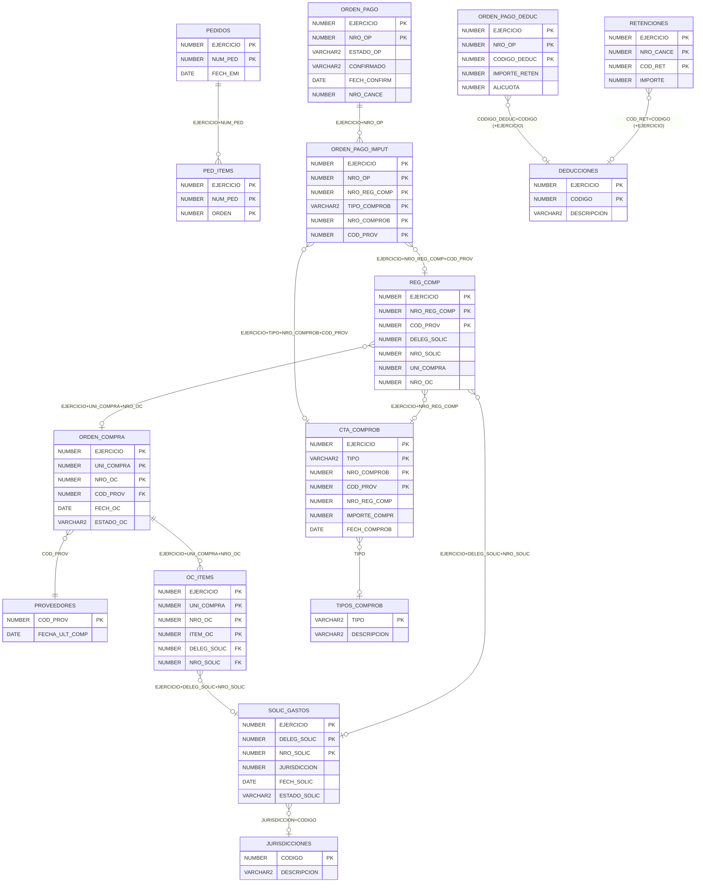

# Esquema RAFAM — `OWNER_RAFAM` — Estructura y JOINs del Pipeline

> Generado automáticamente por `scripts/explore_schema.py` el 2026-06-04 13:35:44
> **No editar manualmente** — regenerar ejecutando el script.

---

## Diagrama de relaciones (JOINs del pipeline)



---

## JOINs del pipeline por entidad

Detalle de cada JOIN que ejecuta `src/source_repository.py` al construir los statements.

### Entidad: `orden_compra`

**1. INNER JOIN** — `ORDEN_COMPRA` ↔ `OC_ITEMS`

```sql
-- Condiciones ON:
   ORDEN_COMPRA.EJERCICIO = OC_ITEMS.EJERCICIO
   ORDEN_COMPRA.UNI_COMPRA = OC_ITEMS.UNI_COMPRA
   ORDEN_COMPRA.NRO_OC = OC_ITEMS.NRO_OC
```

> Trae los ítems de cada OC. El cursor incremental aplica sobre ORDEN_COMPRA.

**2. LEFT JOIN** — `OC_ITEMS` ↔ `SOLIC_GASTOS`

```sql
-- Condiciones ON:
   OC_ITEMS.EJERCICIO = SOLIC_GASTOS.EJERCICIO
   OC_ITEMS.DELEG_SOLIC = SOLIC_GASTOS.DELEG_SOLIC
   OC_ITEMS.NRO_SOLIC = SOLIC_GASTOS.NRO_SOLIC
```

> Obtiene JURISDICCION de la solicitud de gasto vinculada al ítem.

**3. LEFT JOIN (subquery oc_to_cc)** — `ORDEN_COMPRA` ↔ `REG_COMP → CTA_COMPROB`

```sql
-- Condiciones ON:
   ORDEN_COMPRA.EJERCICIO = oc_to_cc.OC_EJERCICIO
   ORDEN_COMPRA.UNI_COMPRA = oc_to_cc.OC_UNI_COMPRA
   ORDEN_COMPRA.NRO_OC = oc_to_cc.OC_NRO
```

> Subquery agrupada: REG_COMP JOIN CTA_COMPROB ON (EJERCICIO, NRO_REG_COMP). Filtra REG_COMP donde UNI_COMPRA y NRO_OC no son NULL. Devuelve MIN(NRO_COMPROB), MIN(TIPO), MIN(COD_PROV) por OC.

### Entidad: `ped_items`

**1. LEFT JOIN** — `PED_ITEMS` ↔ `PEDIDOS`

```sql
-- Condiciones ON:
   PED_ITEMS.EJERCICIO = PEDIDOS.EJERCICIO
   PED_ITEMS.NUM_PED = PEDIDOS.NUM_PED
```

> Trae cabecera del pedido: FECH_EMI, OBSERVACIONES, CODIGO_DEP, COSTO_TOT.

### Entidad: `oc_items`

**1. INNER JOIN** — `OC_ITEMS` ↔ `ORDEN_COMPRA`

```sql
-- Condiciones ON:
   OC_ITEMS.EJERCICIO = ORDEN_COMPRA.EJERCICIO
   OC_ITEMS.UNI_COMPRA = ORDEN_COMPRA.UNI_COMPRA
   OC_ITEMS.NRO_OC = ORDEN_COMPRA.NRO_OC
```

> Trae cabecera OC: COD_PROV, FECH_OC, OBSERVACIONES, ESTADO_OC, etc.

**2. LEFT JOIN** — `OC_ITEMS` ↔ `SOLIC_GASTOS`

```sql
-- Condiciones ON:
   OC_ITEMS.EJERCICIO = SOLIC_GASTOS.EJERCICIO
   OC_ITEMS.DELEG_SOLIC = SOLIC_GASTOS.DELEG_SOLIC
   OC_ITEMS.NRO_SOLIC = SOLIC_GASTOS.NRO_SOLIC
```

> Obtiene JURISDICCION.

**3. LEFT JOIN (subquery oc_to_cc)** — `ORDEN_COMPRA` ↔ `REG_COMP → CTA_COMPROB`

```sql
-- Condiciones ON:
   ORDEN_COMPRA.EJERCICIO = oc_to_cc.OC_EJERCICIO
   ORDEN_COMPRA.UNI_COMPRA = oc_to_cc.OC_UNI_COMPRA
   ORDEN_COMPRA.NRO_OC = oc_to_cc.OC_NRO
```

> Mismo subquery oc_to_cc que en orden_compra.

### Entidad: `solic_gastos`

**1. LEFT JOIN (subquery oc_prov)** — `SOLIC_GASTOS` ↔ `OC_ITEMS → ORDEN_COMPRA`

```sql
-- Condiciones ON:
   SOLIC_GASTOS.EJERCICIO = oc_prov.EJERCICIO
   SOLIC_GASTOS.DELEG_SOLIC = oc_prov.DELEG_SOLIC
   SOLIC_GASTOS.NRO_SOLIC = oc_prov.NRO_SOLIC
```

> Subquery: OC_ITEMS JOIN ORDEN_COMPRA ON (EJERCICIO, UNI_COMPRA, NRO_OC). GROUP BY (EJERCICIO, DELEG_SOLIC, NRO_SOLIC) → MIN(COD_PROV). Resuelve el proveedor de la OC asociada al gasto.

**2. LEFT JOIN (subquery sg_comprobantes)** — `SOLIC_GASTOS` ↔ `REG_COMP → CTA_COMPROB`

```sql
-- Condiciones ON:
   SOLIC_GASTOS.EJERCICIO = sg_comprobantes.EJERCICIO
   SOLIC_GASTOS.DELEG_SOLIC = sg_comprobantes.DELEG_SOLIC
   SOLIC_GASTOS.NRO_SOLIC = sg_comprobantes.NRO_SOLIC
```

> Subquery: REG_COMP JOIN CTA_COMPROB ON (EJERCICIO, NRO_REG_COMP). Filtra REG_COMP.DELEG_SOLIC IS NOT NULL AND NRO_SOLIC IS NOT NULL. GROUP BY (EJERCICIO, DELEG_SOLIC, NRO_SOLIC) → agrega datos de comprobante. Devuelve: NRO_COMPROB, TIPO, FECH_COMPROB, FECH_VENCIM, IMPORTE_COMPR, IMPORTE_NETO, IMPORTE_SIN_IVA, COUNT(comprobantes).

### Entidad: `orden_pago`

**1. LEFT JOIN (subquery op_imput)** — `ORDEN_PAGO` ↔ `ORDEN_PAGO_IMPUT → CTA_COMPROB + REG_COMP`

```sql
-- Condiciones ON:
   ORDEN_PAGO.EJERCICIO = op_imput.OPI_EJERCICIO
   ORDEN_PAGO.NRO_OP = op_imput.OPI_NRO_OP
```

> Bridge PRIMARIO OP ↔ comprobantes. Subquery sin GROUP BY (una fila por CC). ORDEN_PAGO_IMPUT LEFT JOIN CTA_COMPROB ON (EJERCICIO, TIPO=TIPO_COMPROB, NRO_COMPROB, COD_PROV). LEFT JOIN REG_COMP ON (EJERCICIO, NRO_REG_COMP, COD_PROV) para resolver OC. Devuelve: NRO_REG_COMP, TIPO_COMPROB, NRO_COMPROB, COD_PROV, DELEG_SOLIC, NRO_SOLIC, OC_EJERCICIO/NRO/UNI_COMPRA/COD_PROV, importes y fechas de CTA_COMPROB.

### Entidad: `orden_pago (fetch separado)`

**1. LEFT JOIN** — `ORDEN_PAGO_DEDUC` ↔ `DEDUCCIONES`

```sql
-- Condiciones ON:
   ORDEN_PAGO_DEDUC.CODIGO_DEDUC = DEDUCCIONES.CODIGO
   ORDEN_PAGO_DEDUC.EJERCICIO = DEDUCCIONES.EJERCICIO (si existe)
```

> fetch_deducciones_for_ops(): query separada por batch de OPs. Filtro: WHERE (EJERCICIO, NRO_OP) IN (...). Devuelve: CODIGO_DEDUC, IMPORTE_RETEN, ALICUOTA, COMPROB_DEDUC, CUENTA, DESCRIPCION.

### Entidad: `orden_pago (fallback retenciones)`

**1. LEFT JOIN** — `RETENCIONES` ↔ `DEDUCCIONES`

```sql
-- Condiciones ON:
   RETENCIONES.COD_RET = DEDUCCIONES.CODIGO
   RETENCIONES.EJERCICIO = DEDUCCIONES.EJERCICIO (si existe)
```

> fetch_retenciones_for_ops(): fallback si ORDEN_PAGO_DEDUC no está disponible. Filtro: WHERE (EJERCICIO, NRO_CANCE) IN (...). Devuelve: COD_RET, IMPORTE, DESCRIPCION.

### Entidad: `orden_compra / oc_items (dependency filter)`

**1. INNER JOIN chain** — `ORDEN_PAGO` ↔ `ORDEN_PAGO_IMPUT → REG_COMP`

```sql
-- Condiciones ON:
   ORDEN_PAGO.EJERCICIO = ORDEN_PAGO_IMPUT.EJERCICIO
   ORDEN_PAGO.NRO_OP = ORDEN_PAGO_IMPUT.NRO_OP
   ORDEN_PAGO_IMPUT.EJERCICIO = REG_COMP.EJERCICIO
   ORDEN_PAGO_IMPUT.NRO_REG_COMP = REG_COMP.NRO_REG_COMP
   ORDEN_PAGO_IMPUT.COD_PROV = REG_COMP.COD_PROV
```

> Subquery op_required_ocs: identifica OCs vinculadas a OPs confirmadas (ESTADO_OP IN ('C','N'), CONFIRMADO='S', FECH_CONFIRM IS NOT NULL). Se usa como LEFT JOIN al statement de OC/OC_ITEMS para incluir OCs de ejercicios anteriores al EJERCICIO_MIN si tienen OP confirmada reciente.

---

## Filtros y cursores incrementales por entidad

| Entidad | Tabla principal | Cursor incremental | Filtro de estado (reprocess) | Filtro de negocio |
|---------|---------------|-------------------|------------------------------|-------------------|
| `proveedores` | `PROVEEDORES` | FECHA_ULT_COMP >= checkpoint.last_ts | — | — |
| `pedidos` | `PEDIDOS` | FECH_EMI >= checkpoint.last_ts | — | — |
| `ped_items` | `PED_ITEMS` | full_load (sin cursor incremental) | — | — |
| `orden_compra` | `ORDEN_COMPRA` | FECH_OC >= checkpoint.last_ts | ESTADO_OC = 'N' AND FECH_OC >= (now - 30 días) → re-procesa pendientes | EJERCICIO >= RAFAM_EJERCICIO_MIN OR OC requerida por OP confirmada |
| `oc_items` | `OC_ITEMS` | full_load (sin cursor incremental) | — | EJERCICIO >= RAFAM_EJERCICIO_MIN OR OC requerida por OP confirmada |
| `solic_gastos` | `SOLIC_GASTOS` | FECH_SOLIC >= checkpoint.last_ts | ESTADO_SOLIC = 'C' AND FECH_SOLIC >= (now - 30 días) → re-procesa confirmados | — |
| `orden_pago` | `ORDEN_PAGO` | FECH_CONFIRM >= checkpoint.last_ts | ESTADO_OP = 'C' AND FECH_CONFIRM >= (now - 30 días) → re-procesa confirmados | ESTADO_OP = 'C' AND CONFIRMADO = 'S' AND FECH_CONFIRM IS NOT NULL |

**Notas:**
- El cursor usa `>=` (no `>`) para no perder filas en el borde del batch. El endpoint Paxapos es idempotente.
- `pending_reprocess_days=30`: re-envía registros en estado transitorio de los últimos 30 días.
- `EJERCICIO_MIN`: variable de entorno `RAFAM_EJERCICIO_MIN`. Aplica a orden_compra, oc_items, orden_pago.

---

## Estructura de tablas

### Índice

- [ADJUDICACIONES](#adjudicaciones)
- [ADJUDICACIONES_ITEMS](#adjudicaciones_items)
- [CTA_COMPROB](#cta_comprob)
- [DEDUCCIONES](#deducciones)
- [OC_ITEMS](#oc_items)
- [ORDEN_COMPRA](#orden_compra)
- [ORDEN_PAGO](#orden_pago)
- [ORDEN_PAGO_DEDUC](#orden_pago_deduc)
- [ORDEN_PAGO_IMPUT](#orden_pago_imput)
- [PEDIDOS](#pedidos)
- [PED_ITEMS](#ped_items)
- [PROVEEDORES](#proveedores)
- [REG_COMP](#reg_comp)
- [RETENCIONES](#retenciones)
- [SOLIC_GASTOS](#solic_gastos)
- [SOLIC_GASTOS_ITEMS](#solic_gastos_items)
- [TIPOS_COMPROB](#tipos_comprob)

---

### ADJUDICACIONES

**PK:** `EJERCICIO`, `NRO_ADJUDIC`  
**FK:** `TIPO_DOC_APROB` → `TIPO_DOC_RES_PK`, `COD_PROV` → `OWNER_RAFAM.PROVEEDORES`, `MOTIVO_ANUL` → `MOT_BAJ_ADJ_PK`  

| Columna | Tipo | Nulo | Default | Comentario |
|---------|------|------|---------|------------|
| `EJERCICIO` | `NUMBER(4,0)` | ✗ |  |  |
| `NRO_ADJUDIC` | `NUMBER(6,0)` | ✗ |  |  |
| `NRO_COTI` | `NUMBER(6,0)` | ✓ |  |  |
| `DELEG_SOLIC` | `NUMBER(4,0)` | ✓ |  |  |
| `NRO_SOLIC` | `NUMBER(6,0)` | ✓ |  |  |
| `COD_PROV` | `NUMBER(5,0)` | ✗ |  |  |
| `FECH_ADJUD` | `DATE` | ✗ |  |  |
| `TIPO_DOC_APROB` | `VARCHAR2(5)` | ✓ |  |  |
| `NRO_DOC_APROB` | `NUMBER(7,0)` | ✓ |  |  |
| `ANIO_DOC_APROB` | `NUMBER(4,0)` | ✓ |  |  |
| `ESTADO` | `VARCHAR2(1)` | ✗ |  |  |
| `FECH_ANUL` | `DATE` | ✓ |  |  |
| `MOTIVO_ANUL` | `VARCHAR2(6)` | ✓ |  |  |
| `FECH_ENTREGA` | `DATE` | ✓ |  |  |
| `OBSERVACIONES` | `VARCHAR2(2000)` | ✓ |  |  |
| `COND_PAGO` | `VARCHAR2(6)` | ✗ |  |  |
| `DESC_COND_PAGO` | `VARCHAR2(45)` | ✓ |  |  |
| `NRO_LLAMADO` | `NUMBER(6,0)` | ✗ | 1 |  |
| `CERRADA` | `VARCHAR2(1)` | ✓ | 'N' |  |

---

### ADJUDICACIONES_ITEMS

**PK:** `EJERCICIO`, `DELEG_SOLIC`, `NRO_SOLIC`, `NRO_ADJUDIC`, `ITEM_REAL`, `NRO_ALTER`  
**FK:** `EJERCICIO` → `SOLIC_GASTOS_DEF_ITEMS_PK`, `DELEG_SOLIC` → `SOLIC_GASTOS_DEF_ITEMS_PK`, `NRO_SOLIC` → `SOLIC_GASTOS_DEF_ITEMS_PK`, `ITEM_REAL` → `SOLIC_GASTOS_DEF_ITEMS_PK`  

| Columna | Tipo | Nulo | Default | Comentario |
|---------|------|------|---------|------------|
| `EJERCICIO` | `NUMBER(4,0)` | ✗ |  |  |
| `DELEG_SOLIC` | `NUMBER(4,0)` | ✗ |  |  |
| `NRO_SOLIC` | `NUMBER(6,0)` | ✗ |  |  |
| `NRO_COTI` | `NUMBER(6,0)` | ✗ |  |  |
| `COD_PROV` | `NUMBER(5,0)` | ✗ |  |  |
| `NRO_ADJUDIC` | `NUMBER(6,0)` | ✗ |  |  |
| `ITEM_REAL` | `NUMBER(4,0)` | ✗ |  |  |
| `NRO_ALTER` | `NUMBER(4,0)` | ✗ |  |  |
| `DESCRIPCION` | `VARCHAR2(4000)` | ✗ |  |  |
| `COSTO_UNITARIO` | `NUMBER(15,5)` | ✗ |  |  |
| `ESPEC_TEC` | `VARCHAR2(1)` | ✗ |  |  |
| `CANTIDAD` | `NUMBER(10,3)` | ✗ |  |  |
| `CANT_ADJ` | `NUMBER(10,3)` | ✗ |  |  |
| `CANT_COTI` | `NUMBER(10,3)` | ✗ |  |  |
| `OBSERVACIONES` | `VARCHAR2(1000)` | ✓ |  |  |
| `NRO_LLAMADO` | `NUMBER(6,0)` | ✗ | 1 |  |
| `PRECIO_MAXIMO` | `NUMBER(15,5)` | ✓ | 0 |  |

---

### CTA_COMPROB

**PK:** `EJERCICIO`, `TIPO`, `NRO_COMPROB`, `COD_PROV`  
**FK:** `EJERCICIO` → `OWNER_RAFAM.REG_COMP`, `COD_PROV` → `OWNER_RAFAM.PROVEEDORES`, `TIPO` → `OWNER_RAFAM.TIPOS_COMPROB`, `COD_PROV_REAL` → `OWNER_RAFAM.PROVEEDORES`, `NRO_REG_COMP` → `OWNER_RAFAM.REG_COMP`  

| Columna | Tipo | Nulo | Default | Comentario |
|---------|------|------|---------|------------|
| `EJERCICIO` | `NUMBER(4,0)` | ✗ |  |  |
| `TIPO` | `VARCHAR2(3)` | ✗ |  |  |
| `NRO_COMPROB` | `VARCHAR2(13)` | ✗ |  |  |
| `COD_PROV` | `NUMBER(5,0)` | ✗ |  |  |
| `NRO_REG_COMP` | `NUMBER(7,0)` | ✗ |  |  |
| `FECH_MOVIM` | `DATE` | ✗ |  |  |
| `FECH_COMPROB` | `DATE` | ✗ |  |  |
| `FECH_VENCIM` | `DATE` | ✓ |  |  |
| `FECH_CONFORMAC` | `DATE` | ✓ |  |  |
| `PORC_BONIF` | `NUMBER(5,2)` | ✓ |  |  |
| `FECH_BONIF` | `DATE` | ✓ |  |  |
| `IMPORTE_COMPR` | `NUMBER(15,2)` | ✗ |  |  |
| `IMPORTE_PAGADO` | `NUMBER(15,2)` | ✓ |  |  |
| `RINDE_IVA` | `VARCHAR2(1)` | ✗ |  |  |
| `PORC_IVA` | `NUMBER(5,2)` | ✓ |  |  |
| `PORC_CRED_FISCAL` | `NUMBER(5,2)` | ✓ |  |  |
| `LIST_LIBRO_IVA` | `NUMBER(4,0)` | ✓ |  |  |
| `FECH_LIST_IVA` | `DATE` | ✓ |  |  |
| `COD_PROV_REAL` | `NUMBER(5,0)` | ✓ |  |  |
| `RAZON_SOCIAL` | `VARCHAR2(70)` | ✓ |  |  |
| `CUIT` | `VARCHAR2(13)` | ✓ |  |  |
| `DETALLE` | `VARCHAR2(200)` | ✓ |  |  |
| `IMPORTE_SIN_IVA` | `NUMBER(15,2)` | ✓ |  |  |

---

### DEDUCCIONES

**PK:** *(no encontrada)*  

| Columna | Tipo | Nulo | Default | Comentario |
|---------|------|------|---------|------------|
| `CODIGO` | `NUMBER(3,0)` | ✓ |  |  |
| `DESCRIPCION` | `VARCHAR2(100)` | ✓ |  |  |
| `TIPO_DEDUC` | `VARCHAR2(1)` | ✓ |  |  |
| `PORCENTAJE` | `NUMBER(5,2)` | ✓ |  |  |
| `SALDO` | `NUMBER(15,2)` | ✓ |  |  |
| `DECRIPCION_AB` | `VARCHAR2(5)` | ✓ |  |  |
| `CODIGO_AXT` | `NUMBER(5,0)` | ✓ |  |  |
| `EJERCICIO` | `NUMBER(4,0)` | ✓ |  |  |

---

### OC_ITEMS

**PK:** `EJERCICIO`, `UNI_COMPRA`, `NRO_OC`, `ITEM_OC`  
**FK:** `EJERCICIO` → `OWNER_RAFAM.ORDEN_COMPRA`, `UNI_COMPRA` → `OWNER_RAFAM.ORDEN_COMPRA`, `NRO_OC` → `OWNER_RAFAM.ORDEN_COMPRA`  

| Columna | Tipo | Nulo | Default | Comentario |
|---------|------|------|---------|------------|
| `EJERCICIO` | `NUMBER(4,0)` | ✗ |  |  |
| `UNI_COMPRA` | `NUMBER(4,0)` | ✗ |  |  |
| `NRO_OC` | `NUMBER(6,0)` | ✗ |  |  |
| `ITEM_OC` | `NUMBER(4,0)` | ✗ |  |  |
| `DELEG_SOLIC` | `NUMBER(4,0)` | ✗ |  |  |
| `NRO_SOLIC` | `NUMBER(6,0)` | ✗ |  |  |
| `ITEM_REAL` | `NUMBER(4,0)` | ✗ |  |  |
| `DESCRIPCION` | `VARCHAR2(4000)` | ✗ |  |  |
| `CANTIDAD` | `NUMBER(10,3)` | ✗ |  |  |
| `IMP_UNITARIO` | `NUMBER(15,5)` | ✗ |  |  |
| `CANT_RECIB` | `NUMBER(10,3)` | ✓ | 0 |  |
| `IMPORTE_EJER` | `NUMBER(16,5)` | ✓ |  |  |

---

### ORDEN_COMPRA

**PK:** `EJERCICIO`, `UNI_COMPRA`, `NRO_OC`  
**FK:** `COD_LUG_ENT` → `LUGSENT_PK`, `UNI_COMPRA` → `UNI_COMPRA_PK`  

| Columna | Tipo | Nulo | Default | Comentario |
|---------|------|------|---------|------------|
| `EJERCICIO` | `NUMBER(4,0)` | ✗ |  |  |
| `UNI_COMPRA` | `NUMBER(4,0)` | ✗ |  |  |
| `NRO_OC` | `NUMBER(6,0)` | ✗ |  |  |
| `NRO_ADJUD` | `NUMBER(6,0)` | ✗ |  |  |
| `FECH_OC` | `DATE` | ✓ |  |  |
| `LUG_EMI` | `VARCHAR2(5)` | ✗ |  |  |
| `COD_PROV` | `NUMBER(5,0)` | ✗ |  |  |
| `COD_LUG_ENT` | `VARCHAR2(5)` | ✓ |  |  |
| `FECH_ENTREGA` | `DATE` | ✓ |  |  |
| `ESTADO_OC` | `VARCHAR2(1)` | ✓ |  |  |
| `TIPO_DOC_APROB` | `VARCHAR2(5)` | ✓ |  |  |
| `NRO_DOC_APROB` | `NUMBER(7,0)` | ✓ |  |  |
| `ANIO_DOC_APROB` | `NUMBER(4,0)` | ✓ |  |  |
| `CONFIRMADO` | `VARCHAR2(1)` | ✓ |  |  |
| `FECH_CONFIRM` | `DATE` | ✓ |  |  |
| `CANT_IMPRES` | `NUMBER(3,0)` | ✓ |  |  |
| `FECH_ANUL` | `DATE` | ✓ |  |  |
| `MOTIVO_ANUL` | `VARCHAR2(6)` | ✓ |  |  |
| `OBSERVACIONES` | `VARCHAR2(1000)` | ✓ |  |  |
| `IMPORTE_TOT` | `NUMBER(15,5)` | ✗ |  |  |
| `COND_PAGO` | `VARCHAR2(6)` | ✗ |  |  |
| `DESC_COND_PAGO` | `VARCHAR2(45)` | ✓ |  |  |
| `OC_DIFERIDO` | `VARCHAR2(1)` | ✓ | 'N' |  |

---

### ORDEN_PAGO

**PK:** `EJERCICIO`, `NRO_OP`  
**FK:** `EJERCICIO` → `ASIENTOS_PK`, `EJERCICIO` → `ASIENTOS_PK`, `COD_EMP` → `EMPRESTITOS_PK`, `TIPO_DOC` → `TIPO_DOC_RES_PK`, `EJERCICIO` → `FUEN_FIN_PK`, `COD_PROV` → `OWNER_RAFAM.PROVEEDORES`, `CODIGO_UE` → `UNI_EJEC_PK`, `LUG_EMI` → `LOCALIDADES_PK`, `JURISDICCION` → `JURIS_PK`, `ASIENTO_ANUL` → `ASIENTOS_PK`, `CODIGO_FF` → `FUEN_FIN_PK`, `ASIENTO` → `ASIENTOS_PK`  

| Columna | Tipo | Nulo | Default | Comentario |
|---------|------|------|---------|------------|
| `EJERCICIO` | `NUMBER(4,0)` | ✗ |  |  |
| `NRO_OP` | `NUMBER(7,0)` | ✗ |  |  |
| `FECH_OP` | `DATE` | ✗ |  |  |
| `LUG_EMI` | `VARCHAR2(5)` | ✗ |  |  |
| `CODIGO_FF` | `NUMBER(3,0)` | ✓ |  |  |
| `JURISDICCION` | `VARCHAR2(10)` | ✗ |  |  |
| `CODIGO_UE` | `NUMBER(2,0)` | ✓ |  |  |
| `COD_PROV` | `NUMBER(5,0)` | ✗ |  |  |
| `TIPO_OP` | `VARCHAR2(1)` | ✗ |  |  |
| `ESTADO_OP` | `VARCHAR2(1)` | ✗ |  |  |
| `TIPO_DOC` | `VARCHAR2(5)` | ✓ |  |  |
| `NRO_DOC` | `NUMBER(7,0)` | ✓ |  |  |
| `ANIO_DOC` | `NUMBER(4,0)` | ✓ |  |  |
| `NRO_CANCE` | `NUMBER(7,0)` | ✓ |  |  |
| `CONFIRMADO` | `VARCHAR2(1)` | ✗ |  |  |
| `FECH_CONFIRM` | `DATE` | ✓ |  |  |
| `IMPORTE_TOTAL` | `NUMBER(15,2)` | ✗ |  |  |
| `IMPORTE_LIQUIDO` | `NUMBER(15,2)` | ✗ |  |  |
| `CANT_IMPRES` | `NUMBER(4,0)` | ✓ |  |  |
| `FECH_ANUL` | `DATE` | ✓ |  |  |
| `MOTIVO_ANUL` | `VARCHAR2(6)` | ✓ |  |  |
| `CONCEPTO` | `VARCHAR2(1000)` | ✓ |  |  |
| `OBSERVACIONES` | `VARCHAR2(300)` | ✓ |  |  |
| `COD_EMP` | `VARCHAR2(5)` | ✓ |  |  |
| `IMPORTE_BONIFICACION` | `NUMBER(15,2)` | ✗ |  |  |
| `IMPORTE_DEDUCCIONES` | `NUMBER(15,2)` | ✗ |  |  |
| `ASIENTO` | `NUMBER(7,0)` | ✓ |  |  |
| `ASIENTO_ANUL` | `NUMBER(7,0)` | ✓ |  |  |
| `MONTO_SIN_IVA` | `NUMBER(15,2)` | ✓ |  |  |
| `DEUDA` | `VARCHAR2(1)` | ✗ | 'N' |  |
| `BLOQUEADA` | `VARCHAR2(1)` | ✓ | 'N' |  |
| `RECURSO` | `VARCHAR2(15)` | ✓ |  |  |
| `PERCIBIDO` | `NUMBER(15,2)` | ✓ |  |  |
| `NO_PAGADO` | `NUMBER(15,2)` | ✓ |  |  |
| `PAGADO` | `NUMBER(15,2)` | ✓ |  |  |
| `RECO_DEU_ORDEN` | `NUMBER(7,0)` | ✓ |  |  |
| `RECO_DEU_EJERCICIO` | `NUMBER(4,0)` | ✓ |  |  |
| `RECO_DEU_COMPRA` | `NUMBER(7,0)` | ✓ |  |  |
| `RECO_DEU_COMPRA_EJER` | `NUMBER(4,0)` | ✓ |  |  |
| `F931` | `VARCHAR2(1)` | ✓ |  |  |
| `SICORE` | `VARCHAR2(1)` | ✓ | 'S' |  |

---

### ORDEN_PAGO_DEDUC

**PK:** `EJERCICIO`, `NRO_OP`, `CODIGO_DEDUC`  
**FK:** `EJERCICIO` → `OWNER_RAFAM.DEDUCCIONES`, `CODIGO_DEDUC` → `OWNER_RAFAM.DEDUCCIONES`  

| Columna | Tipo | Nulo | Default | Comentario |
|---------|------|------|---------|------------|
| `EJERCICIO` | `NUMBER(4,0)` | ✗ |  |  |
| `NRO_OP` | `NUMBER(7,0)` | ✗ |  |  |
| `CODIGO_DEDUC` | `NUMBER(3,0)` | ✗ |  |  |
| `IMPORTE_RETEN` | `NUMBER(15,2)` | ✗ |  |  |
| `COMPROB_DEDUC` | `NUMBER(7,0)` | ✗ |  |  |
| `ALICUOTA` | `NUMBER(5,2)` | ✓ |  |  |
| `CANT_IMPRES` | `NUMBER(4,0)` | ✓ |  |  |
| `TIPO_GENERAC` | `VARCHAR2(1)` | ✗ |  |  |
| `CUENTA` | `VARCHAR2(9)` | ✓ |  |  |
| `COEF_CONV_MULTI` | `NUMBER(6,5)` | ✗ | 1 |  |
| `ACTIVIDAD` | `VARCHAR2(10)` | ✓ |  |  |
| `TIPO_ALICUOTA` | `VARCHAR2(5)` | ✓ |  | PA: corresponde al padrón para año y mes. PMA: Padrón mes anterior. D: Alicuota default. M: Modificada por el usuario |

---

### ORDEN_PAGO_IMPUT

**PK:** `EJERCICIO`, `NRO_OP`, `NRO_REG_COMP`, `TIPO_COMPROB`, `NRO_COMPROB`, `COD_PROV`, `CODIGO_FF`, `INCISO`, `PAR_PRIN`, `PAR_PARC`, `PAR_SUBP`, `JURISDICCION`, `PROGRAMA`, `ACTIV_PROY`, `ACTIV_OBRA`  

| Columna | Tipo | Nulo | Default | Comentario |
|---------|------|------|---------|------------|
| `EJERCICIO` | `NUMBER(4,0)` | ✗ |  |  |
| `NRO_OP` | `NUMBER(7,0)` | ✗ |  |  |
| `NRO_REG_COMP` | `NUMBER(7,0)` | ✗ |  |  |
| `TIPO_COMPROB` | `VARCHAR2(3)` | ✗ |  |  |
| `NRO_COMPROB` | `VARCHAR2(13)` | ✗ |  |  |
| `COD_PROV` | `NUMBER(5,0)` | ✗ |  |  |
| `CODIGO_FF` | `NUMBER(3,0)` | ✗ |  |  |
| `INCISO` | `NUMBER(1,0)` | ✗ |  |  |
| `PAR_PRIN` | `NUMBER(1,0)` | ✗ |  |  |
| `PAR_PARC` | `NUMBER(1,0)` | ✗ |  |  |
| `PAR_SUBP` | `NUMBER(1,0)` | ✗ |  |  |
| `JURISDICCION` | `VARCHAR2(10)` | ✗ |  |  |
| `PROGRAMA` | `NUMBER(2,0)` | ✗ |  |  |
| `ACTIV_PROY` | `NUMBER(2,0)` | ✗ |  |  |
| `ACTIV_OBRA` | `NUMBER(2,0)` | ✗ |  |  |
| `IMPORTE_IMPUT` | `NUMBER(15,2)` | ✗ |  |  |

---

### PEDIDOS

**PK:** `EJERCICIO`, `NUM_PED`  
**FK:** `LUG_EMI` → `LOCALIDADES_PK`, `EJERCICIO` → `FUEN_FIN_PK`, `JURISDICCION` → `JURIS_PK`, `JURISDICCION` → `DEPENDENCIAS_JURICOD_UKC`, `CODIGO_UE` → `UNI_EJEC_PK`, `CODIGO_DEP` → `DEPENDENCIAS_JURICOD_UKC`, `CODIGO_FF` → `FUEN_FIN_PK`  

| Columna | Tipo | Nulo | Default | Comentario |
|---------|------|------|---------|------------|
| `EJERCICIO` | `NUMBER(4,0)` | ✗ |  |  |
| `NUM_PED` | `NUMBER(6,0)` | ✗ |  |  |
| `LUG_EMI` | `VARCHAR2(5)` | ✗ |  |  |
| `FECH_EMI` | `DATE` | ✗ |  |  |
| `NUM_PED_ORI` | `NUMBER(6,0)` | ✓ |  |  |
| `FECH_EMI_ORI` | `DATE` | ✓ |  |  |
| `CODIGO_DEP` | `VARCHAR2(6)` | ✗ |  |  |
| `CODIGO_UE` | `NUMBER(2,0)` | ✗ |  |  |
| `JURISDICCION` | `VARCHAR2(10)` | ✗ |  |  |
| `COSTO_TOT` | `NUMBER(15,2)` | ✗ |  |  |
| `OBSERVACIONES` | `VARCHAR2(4000)` | ✓ |  |  |
| `PED_ESTADO` | `VARCHAR2(5)` | ✗ |  |  |
| `CANT_IMP` | `NUMBER(2,0)` | ✗ |  |  |
| `FECH_MODI_ULT` | `DATE` | ✓ |  |  |
| `CODIGO_FF` | `NUMBER(3,0)` | ✓ |  |  |
| `COD_LUG_ENT` | `VARCHAR2(5)` | ✓ |  |  |
| `PLAZO_ENT` | `VARCHAR2(6)` | ✓ |  |  |
| `PER_CONSUMO` | `VARCHAR2(1000)` | ✓ |  |  |
| `FECH_ING_COMP` | `DATE` | ✓ |  |  |
| `RESP_RETIRA_PED` | `VARCHAR2(5)` | ✓ |  |  |

---

### PED_ITEMS

**PK:** `EJERCICIO`, `NUM_PED`, `ORDEN`  
**FK:** `EJERCICIO` → `OWNER_RAFAM.PEDIDOS`, `CLASE` → `CAT_ITEM_PK`, `UNI_MED` → `CAT_UNI_MED_PK`, `EJERCICIO` → `ESTRUC_PROG_PK`, `NUM_PED` → `OWNER_RAFAM.PEDIDOS`, `TIPO` → `CAT_ITEM_PK`, `JURISDICCION` → `ESTRUC_PROG_PK`, `PROGRAMA` → `ESTRUC_PROG_PK`, `ACTIV_PROY` → `ESTRUC_PROG_PK`, `ACTIV_OBRA` → `ESTRUC_PROG_PK`  

| Columna | Tipo | Nulo | Default | Comentario |
|---------|------|------|---------|------------|
| `EJERCICIO` | `NUMBER(4,0)` | ✗ |  |  |
| `NUM_PED` | `NUMBER(6,0)` | ✗ |  |  |
| `ORDEN` | `NUMBER(5,0)` | ✗ |  |  |
| `INCISO` | `NUMBER(1,0)` | ✗ |  |  |
| `PAR_PRIN` | `NUMBER(1,0)` | ✗ |  |  |
| `PAR_PARC` | `NUMBER(1,0)` | ✗ |  |  |
| `CLASE` | `NUMBER(5,0)` | ✗ |  |  |
| `TIPO` | `NUMBER(4,0)` | ✗ |  |  |
| `JURISDICCION` | `VARCHAR2(10)` | ✗ |  |  |
| `PROGRAMA` | `NUMBER(2,0)` | ✗ |  |  |
| `ACTIV_PROY` | `NUMBER(2,0)` | ✗ |  |  |
| `ACTIV_OBRA` | `NUMBER(2,0)` | ✗ |  |  |
| `CANTIDAD` | `NUMBER(10,3)` | ✗ |  |  |
| `UNI_MED` | `NUMBER(4,0)` | ✗ |  |  |
| `DESCRIP_BIE` | `VARCHAR2(4000)` | ✗ |  |  |
| `COSTO_UNI` | `NUMBER(15,5)` | ✗ |  |  |

---

### PROVEEDORES

**PK:** `COD_PROV`  
**FK:** `PROV_POSTAL` → `PROVINCIAS_PK`, `TIPO_PROV` → `TIPOS_PROVEEDORES_PK`, `TIPO_SOC` → `TIPOS_SOCIEDADES_PK`, `LOCA_LEGAL` → `LOCALIDADES_PK`, `COD_IVA` → `POSIVA_PK`, `CALIF_PROV` → `CALIFICACIONES_PK`, `PROV_LEGAL` → `PROVINCIAS_PK`, `LOCA_POSTAL` → `LOCALIDADES_PK`  

| Columna | Tipo | Nulo | Default | Comentario |
|---------|------|------|---------|------------|
| `COD_PROV` | `NUMBER(5,0)` | ✗ |  |  |
| `RAZON_SOCIAL` | `VARCHAR2(70)` | ✗ |  |  |
| `TIPO_PROV` | `VARCHAR2(5)` | ✗ |  |  |
| `CUIT` | `VARCHAR2(13)` | ✗ |  |  |
| `FANTASIA` | `VARCHAR2(70)` | ✗ |  |  |
| `TIPO_SOC` | `VARCHAR2(5)` | ✗ |  |  |
| `COD_IVA` | `VARCHAR2(5)` | ✗ |  |  |
| `ING_BRUTOS` | `VARCHAR2(25)` | ✓ |  |  |
| `FECHA_ALTA` | `DATE` | ✗ |  |  |
| `FECHA_ULT_COMP` | `DATE` | ✓ |  |  |
| `CALIF_PROV` | `VARCHAR2(5)` | ✗ |  |  |
| `COD_ESTADO` | `NUMBER(1,0)` | ✗ |  |  |
| `CALLE_POSTAL` | `VARCHAR2(40)` | ✗ |  |  |
| `NRO_POSTAL` | `VARCHAR2(5)` | ✗ |  |  |
| `NRO_POSTAL_MED` | `VARCHAR2(3)` | ✓ |  |  |
| `PISO_POSTAL` | `VARCHAR2(4)` | ✓ |  |  |
| `DEPT_POSTAL` | `VARCHAR2(4)` | ✓ |  |  |
| `LOCA_POSTAL` | `VARCHAR2(5)` | ✗ |  |  |
| `COD_POSTAL` | `VARCHAR2(8)` | ✗ |  |  |
| `PROV_POSTAL` | `VARCHAR2(5)` | ✗ |  |  |
| `PAIS_POSTAL` | `VARCHAR2(20)` | ✗ |  |  |
| `CALLE_LEGAL` | `VARCHAR2(40)` | ✗ |  |  |
| `NRO_LEGAL` | `VARCHAR2(5)` | ✗ |  |  |
| `NRO_LEGAL_MED` | `VARCHAR2(3)` | ✓ |  |  |
| `PISO_LEGAL` | `VARCHAR2(4)` | ✓ |  |  |
| `DEPT_LEGAL` | `VARCHAR2(4)` | ✓ |  |  |
| `LOCA_LEGAL` | `VARCHAR2(5)` | ✗ |  |  |
| `COD_LEGAL` | `VARCHAR2(8)` | ✗ |  |  |
| `PROV_LEGAL` | `VARCHAR2(5)` | ✗ |  |  |
| `PAIS_LEGAL` | `VARCHAR2(20)` | ✗ |  |  |
| `NRO_PAIS_TE1` | `VARCHAR2(3)` | ✓ |  |  |
| `NRO_INTE_TE1` | `VARCHAR2(6)` | ✓ |  |  |
| `NRO_TELE_TE1` | `VARCHAR2(12)` | ✓ |  |  |
| `NRO_PAIS_TE2` | `VARCHAR2(3)` | ✓ |  |  |
| `NRO_INTE_TE2` | `VARCHAR2(6)` | ✓ |  |  |
| `NRO_TELE_TE2` | `VARCHAR2(12)` | ✓ |  |  |
| `NRO_PAIS_TE3` | `VARCHAR2(3)` | ✓ |  |  |
| `NRO_INTE_TE3` | `VARCHAR2(6)` | ✓ |  |  |
| `NRO_TELE_TE3` | `VARCHAR2(12)` | ✓ |  |  |
| `TE_CELULAR` | `VARCHAR2(15)` | ✓ |  |  |
| `FAX` | `VARCHAR2(15)` | ✓ |  |  |
| `EMAIL` | `VARCHAR2(50)` | ✓ |  |  |
| `OBSERVACION` | `VARCHAR2(2000)` | ✓ |  |  |
| `PROV_CAJA_CHICA` | `VARCHAR2(1)` | ✗ |  |  |
| `NRO_HAB_MUN` | `VARCHAR2(6)` | ✓ |  |  |
| `DISC_RET_SUSS` | `VARCHAR2(1)` | ✓ | 'S' |  |
| `DISC_GCIAS_UTE` | `VARCHAR2(1)` | ✓ | 'S' |  |
| `DISC_IIBB_UTE` | `VARCHAR2(1)` | ✓ | 'N' |  |

---

### REG_COMP

**PK:** `EJERCICIO`, `NRO_REG_COMP`  
**FK:** `CODIGO_UE` → `UNI_EJEC_PK`, `COD_PROV` → `OWNER_RAFAM.PROVEEDORES`, `JURISDICCION` → `DEPENDENCIAS_JURICOD_UKC`, `LUG_EMI` → `LOCALIDADES_PK`, `EJERCICIO` → `FUEN_FIN_PK`, `JURISDICCION` → `JURIS_PK`, `TIPO_DOC` → `TIPO_DOC_RES_PK`, `MOTIVO_ANUL` → `MOT_BAJ_RC_PK`, `DEPENDENCIA` → `DEPENDENCIAS_JURICOD_UKC`, `CODIGO_FF` → `FUEN_FIN_PK`  

| Columna | Tipo | Nulo | Default | Comentario |
|---------|------|------|---------|------------|
| `EJERCICIO` | `NUMBER(4,0)` | ✗ |  |  |
| `NRO_REG_COMP` | `NUMBER(7,0)` | ✗ |  |  |
| `FECH_REG_COMP` | `DATE` | ✗ |  |  |
| `LUG_EMI` | `VARCHAR2(5)` | ✗ |  |  |
| `JURISDICCION` | `VARCHAR2(10)` | ✗ |  |  |
| `CODIGO_UE` | `NUMBER(2,0)` | ✗ |  |  |
| `COD_PROV` | `NUMBER(5,0)` | ✗ |  |  |
| `TIPO_REGIS` | `VARCHAR2(1)` | ✗ |  |  |
| `NRO_ORIG` | `NUMBER(6,0)` | ✓ |  |  |
| `CODIGO_FF` | `NUMBER(3,0)` | ✗ |  |  |
| `UNI_COMPRA` | `NUMBER(4,0)` | ✓ |  |  |
| `NRO_OC` | `NUMBER(6,0)` | ✓ |  |  |
| `DELEG_SOLIC` | `NUMBER(4,0)` | ✓ |  |  |
| `NRO_SOLIC` | `NUMBER(6,0)` | ✓ |  |  |
| `TIPO_DOC` | `VARCHAR2(5)` | ✓ |  |  |
| `NRO_DOC` | `NUMBER(7,0)` | ✓ |  |  |
| `ANIO_DOC` | `NUMBER(4,0)` | ✓ |  |  |
| `IMPORTE_TOT` | `NUMBER(15,2)` | ✗ |  |  |
| `ESTADO_REG_COMP` | `VARCHAR2(1)` | ✓ |  |  |
| `CONFIRMADO` | `VARCHAR2(1)` | ✗ |  |  |
| `FECH_CONFIRM` | `DATE` | ✓ |  |  |
| `FECH_ANUL` | `DATE` | ✓ |  |  |
| `MOTIVO_ANUL` | `VARCHAR2(6)` | ✓ |  |  |
| `CANT_IMPRES` | `NUMBER(3,0)` | ✓ |  |  |
| `CONCEPTO` | `VARCHAR2(1000)` | ✓ |  |  |
| `FECH_RELOJ` | `DATE` | ✓ |  |  |
| `DEUDA` | `VARCHAR2(1)` | ✗ |  |  |
| `DEPENDENCIA` | `VARCHAR2(6)` | ✗ |  |  |
| `INSISTIDO` | `DATE` | ✓ |  |  |
| `RC_DIFERIDO` | `VARCHAR2(1)` | ✓ | 'N' |  |
| `EJERCICIO_ANT` | `NUMBER(4,0)` | ✓ |  |  |
| `NRO_REG_COMP_ANT` | `NUMBER(7,0)` | ✓ |  |  |
| `RC_EJERCICIO_ANT` | `VARCHAR2(1)` | ✓ | 'N' |  |

---

### RETENCIONES

**PK:** `EJERCICIO`, `NRO_CANCE`, `COD_RET`, `CUENTA`  
**FK:** `EJERCICIO` → `EGRESOS_PK`, `EJERCICIO` → `OWNER_RAFAM.DEDUCCIONES`, `NRO_CANCE` → `EGRESOS_PK`, `COD_RET` → `OWNER_RAFAM.DEDUCCIONES`  

| Columna | Tipo | Nulo | Default | Comentario |
|---------|------|------|---------|------------|
| `EJERCICIO` | `NUMBER(4,0)` | ✗ |  |  |
| `NRO_CANCE` | `NUMBER(7,0)` | ✗ |  |  |
| `COD_RET` | `NUMBER(3,0)` | ✗ |  |  |
| `IMPORTE` | `NUMBER(15,2)` | ✓ |  |  |
| `CUENTA` | `VARCHAR2(9)` | ✗ |  |  |

---

### SOLIC_GASTOS

**PK:** `EJERCICIO`, `DELEG_SOLIC`, `NRO_SOLIC`  
**FK:** `DELEG_SOLIC` → `DELEGACIONES_PK`, `TIPO_DOC` → `TIPO_DOC_RES_PK`, `JURISDICCION` → `DEPENDENCIAS_JURICOD_UKC`, `EJERCICIO` → `OWNER_RAFAM.PEDIDOS`, `CODIGO_UE` → `UNI_EJEC_PK`, `COD_LUG_ENT` → `LUGSENT_PK`, `JURISDICCION` → `JURIS_PK`, `EJERCICIO` → `FUEN_FIN_PK`, `CODIGO_DEP` → `DEPENDENCIAS_JURICOD_UKC`, `NRO_PED` → `OWNER_RAFAM.PEDIDOS`, `CODIGO_FF` → `FUEN_FIN_PK`  

| Columna | Tipo | Nulo | Default | Comentario |
|---------|------|------|---------|------------|
| `EJERCICIO` | `NUMBER(4,0)` | ✗ |  |  |
| `DELEG_SOLIC` | `NUMBER(4,0)` | ✗ |  |  |
| `NRO_SOLIC` | `NUMBER(6,0)` | ✗ |  |  |
| `NRO_PED` | `NUMBER(6,0)` | ✓ |  |  |
| `LUG_EMI` | `VARCHAR2(5)` | ✗ |  |  |
| `JURISDICCION` | `VARCHAR2(10)` | ✗ |  |  |
| `CODIGO_UE` | `NUMBER(2,0)` | ✗ |  |  |
| `CODIGO_DEP` | `VARCHAR2(6)` | ✗ |  |  |
| `FECH_SOLIC` | `DATE` | ✗ |  |  |
| `TIPO_REGIS` | `VARCHAR2(1)` | ✗ |  |  |
| `NRO_ORIG` | `NUMBER(6,0)` | ✓ |  |  |
| `CODIGO_FF` | `NUMBER(3,0)` | ✗ |  |  |
| `IMPORTE_TOT` | `NUMBER(15,2)` | ✗ |  |  |
| `FECH_ENTREGA` | `DATE` | ✓ |  |  |
| `FECH_NECESIDAD` | `DATE` | ✓ |  |  |
| `FECH_EST_OC` | `DATE` | ✓ |  |  |
| `TIPO_DOC` | `VARCHAR2(5)` | ✓ |  |  |
| `NRO_DOC` | `NUMBER(7,0)` | ✓ |  |  |
| `ANIO_DOC` | `NUMBER(4,0)` | ✓ |  |  |
| `COD_LUG_ENT` | `VARCHAR2(5)` | ✓ |  |  |
| `ESTADO_SOLIC` | `VARCHAR2(1)` | ✓ |  |  |
| `CONFIRMADO` | `VARCHAR2(1)` | ✗ |  |  |
| `FECH_CONFIRM` | `DATE` | ✓ |  |  |
| `FECH_ANUL` | `DATE` | ✓ |  |  |
| `MOTIVO_ANUL` | `VARCHAR2(6)` | ✓ |  |  |
| `OBSERVACIONES` | `VARCHAR2(120)` | ✓ |  |  |
| `CANT_IMP` | `NUMBER(2,0)` | ✗ |  |  |
| `SG_DIFERIDO` | `VARCHAR2(1)` | ✓ |  |  |

---

### SOLIC_GASTOS_ITEMS

**PK:** `EJERCICIO`, `DELEG_SOLIC`, `NRO_SOLIC`, `SOLIC_ITEM`  
**FK:** `JURISDICCION` → `JURIS_PK`, `EJERCICIO` → `ESTRUC_PROG_PK`, `JURISDICCION` → `ESTRUC_PROG_PK`, `PROGRAMA` → `ESTRUC_PROG_PK`, `ACTIV_PROY` → `ESTRUC_PROG_PK`, `ACTIV_OBRA` → `ESTRUC_PROG_PK`  

| Columna | Tipo | Nulo | Default | Comentario |
|---------|------|------|---------|------------|
| `EJERCICIO` | `NUMBER(4,0)` | ✗ |  |  |
| `DELEG_SOLIC` | `NUMBER(4,0)` | ✗ |  |  |
| `NRO_SOLIC` | `NUMBER(6,0)` | ✗ |  |  |
| `SOLIC_ITEM` | `NUMBER(4,0)` | ✗ |  |  |
| `INCISO` | `NUMBER(1,0)` | ✗ |  |  |
| `PAR_PRIN` | `NUMBER(1,0)` | ✗ |  |  |
| `PAR_PARC` | `NUMBER(1,0)` | ✗ |  |  |
| `PAR_SUBP` | `NUMBER(1,0)` | ✗ |  |  |
| `TIPO` | `NUMBER(4,0)` | ✗ |  |  |
| `CLASE` | `NUMBER(5,0)` | ✗ |  |  |
| `JURISDICCION` | `VARCHAR2(10)` | ✗ |  |  |
| `PROGRAMA` | `NUMBER(2,0)` | ✗ |  |  |
| `ACTIV_PROY` | `NUMBER(2,0)` | ✗ |  |  |
| `ACTIV_OBRA` | `NUMBER(2,0)` | ✗ |  |  |
| `DESCRIPCION` | `VARCHAR2(4000)` | ✗ |  |  |
| `CODIGO_UM` | `NUMBER(4,0)` | ✗ |  |  |
| `CANTIDAD` | `NUMBER(10,3)` | ✗ |  |  |
| `IMP_UNITARIO` | `NUMBER(15,5)` | ✗ |  |  |
| `CANT_ADJ` | `NUMBER(10,3)` | ✗ |  |  |
| `CANT_COTI` | `NUMBER(10,3)` | ✗ |  |  |
| `CANTIDAD_REAL` | `NUMBER(10,3)` | ✓ |  |  |
| `IMP_UNITARIO_REAL` | `NUMBER(15,5)` | ✓ |  |  |
| `IMPORTE_EJER` | `NUMBER(16,5)` | ✓ |  |  |
| `IMPORTE_DIFER` | `NUMBER(16,5)` | ✓ |  |  |
| `IMPORTE_EJER_REAL` | `NUMBER(16,5)` | ✓ |  |  |
| `IMPORTE_DIFER_REAL` | `NUMBER(16,5)` | ✓ |  |  |

---

### TIPOS_COMPROB

**PK:** `TIPO`  

| Columna | Tipo | Nulo | Default | Comentario |
|---------|------|------|---------|------------|
| `TIPO` | `VARCHAR2(3)` | ✗ |  |  |
| `DESCRIPCION` | `VARCHAR2(30)` | ✓ |  |  |
| `IVA` | `VARCHAR2(1)` | ✓ |  |  |
| `DEBITO_CREDITO` | `VARCHAR2(1)` | ✓ |  |  |
| `FORMULA_NETO` | `VARCHAR2(50)` | ✓ |  |  |
| `RINDE_PERCEP` | `VARCHAR2(1)` | ✓ |  |  |
